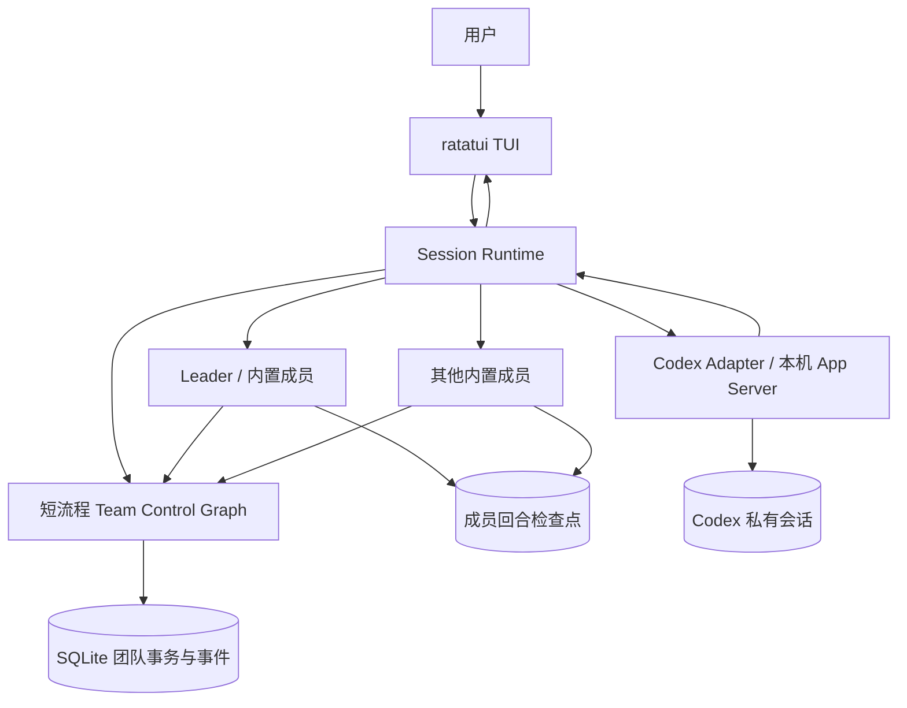

# TeamAgents 首版完整实现方案

日期：2026-09-11。状态：实施设计，产品功能与兼容性须按开发阶段完成并通过验收。

2026-09-15 文档核对：已确认的 Rust 迁移与后续决策同步到正文。本文仍是产品基准，
不能把要求视为全部已实现；当前测试结果、实际限制及未满足的条目统一见
[验收对照表](docs/ACCEPTANCE.md#当前实现与方案的已知差异)。

本文独立定义 TeamAgents 首版的产品范围、架构、执行合约、技术选型、开发顺序和验收标准，作为实现与评审的基准。功能范围与核心约束是首版要求；明确标注为“建议”的默认值可按部署环境调整。所有开发阶段均属于同一首版，全部完成并通过验收后才满足发布条件。

## 1. 产品定义与首版范围

TeamAgents 是运行于 Linux 的通用终端 Agent 产品，提供完整终端用户界面（TUI），支持持续对话、工具操作和团队管理。任务由用户自然语言提出，不绑定预设行业、代码工作流或固定角色数量。

| 项目 | 首版要求 |
|---|---|
| 用户入口 | TUI；用户始终直接与 Leader 交互 |
| 团队建立 | Leader 理解需求后自动组队；用户可以查看、调整；Leader 一人成队合法 |
| 首版团队能力 | 委派、并行、讨论、观察者、共享空间、信息隔离、多模型、恢复、自然语言组队、动态拓扑全部包含 |
| 团队变更 | 成员或用户提出需求，Leader 决策，运行时校验后自动生效，无需用户确认 |
| 变更生效点 | 默认等待受影响成员当前回合结束；允许显式取消，停止后应用 |
| 内置成员 | TeamAgents 成员运行时；按成员配置模型、工具和 Skills |
| 外部成员 | 首版接入本机 Codex CLI；接受任务，返回进度和结果，由 Leader 代为协作 |
| 模型服务 | OpenAI、Anthropic、Kimi、DeepSeek、GLM |
| 工作目录 | 共享与隔离均支持，由 Leader 按任务选择；Git 项目支持 worktree |
| 默认工具权限 | 预授权范围内自动执行，超出范围请求用户批准 |
| 全自动模式 | 用户可主动开启，使用当前用户的系统权限，无需逐次批准 |
| 执行中补充要求 | Leader 尽快处理；相关成员在安全边界接收调整，其他工作继续 |
| 会话生命周期 | 同一会话保留团队与上下文；Leader 决定复用或调整；新会话默认隔离 |
| Leader 可见范围 | 任务进度、结果、定向消息、获准观察的事件；成员私有上下文保持隔离 |
| 工具范围 | 文件读写与搜索、终端命令、网页搜索与抓取、MCP、Skills |

首版不包含原生 Windows/macOS 支持、分布式执行、远程成员协议、Claude Code/pi 适配器、浏览器自动化、多模态产品交互或插件市场。通用任务通过模型与已配置工具执行，不承诺所有任务都无需环境、凭据或外部服务。

## 2. 架构职责与核心约束

### 2.1 职责边界

| 组件 | 负责内容 |
|---|---|
| TeamAgents | 成员身份、团队结构、通信与观察权限、任务委派、调度、共享空间、拓扑变更及团队事件 |
| Codex | 外部执行成员自身的任务执行与私有会话；TeamAgents 通过适配器管理其生命周期和结果 |
| ratatui TUI | 用户交互、运行状态展示和控制命令输入；不持有权威业务状态 |

TeamAgents 自含个体 Agent 工具循环、持久化执行、文件工具和 Linux 隔离组件，新增团队协调所需的语义与适配。MCP（Model Context Protocol）用于接入外部工具；Skills 是供成员按需加载的技能指令和资源，其加载与权限规则见第 12 节。

### 2.2 核心约束

1. **团队结构是经过校验的数据。** 成员、通道、观察和共享权限由 TeamSpec 表达，模型生成的代码不能替代团队定义。
2. **Leader 始终存在。** Leader 是用户的自然语言入口和团队变更决策者；单 Leader 团队必须完整运行。
3. **成员有独立身份和上下文。** 私有子代理不自动成为团队成员；Leader 的管理权限不自动赋予其读取成员私有历史的权限。
4. **信息权限在运行时执行。** 发送、观察、共享空间读写和工具权限分别校验，不能只靠提示词约定。
5. **成员独立推进。** 同一成员同时最多执行一个活动回合，Leader 的交互不等待所有工作成员结束；变更在受影响成员的安全边界生效。
6. **状态有明确权威来源。** TeamState 是紧凑运行视图；团队事实与动作回执以业务事务为准，成员执行检查点由成员运行时或 Codex 管理。
7. **模型配置与拓扑分离。** 成员引用逻辑模型配置，供应商和凭据变化不改变其团队通信权限。
8. **执行有边界、结果可追溯。** 任务完成、失败、取消和结果不明分别记录；资源超限不能冒充成功，取消不能冒充副作用回滚。

## 3. 技术选型与架构决策

实现采用 Rust：`core`（rusqlite/SQLite，WAL）、`engine`（线程模型的运行时与成员后端）、`tui`（ratatui）。依赖用 Cargo 管理并提交锁文件。`core` 的库接口是内部可测试的核心接口，首要产品入口是 TUI。

本文使用三组稳定编号：`DP-1`～`DP-12` 表示下表完整定义的架构决策，`P0`～`P7` 表示第 16 节的开发阶段，`T1`～`T24` 表示第 17 节的验收场景。外部官方文档链接用于核对依赖接口，产品要求和实现约束以本文为准。

| 决策 | 首版选择 | 实施含义 |
|---|---|---|
| DP-1 执行结构 | 通用团队控制图 | 固定小图处理团队事务；拓扑是数据，不按团队形状生成代码 |
| DP-2 调度 | 混合 | Leader 负责语义决策；代码负责就绪队列、并发限额、权限和终止条件 |
| DP-3 通信 | 持久化事件 + 收件视图 | 消息与任务形成事件；按权限、收件人和消费位置构造增量视图 |
| DP-4 共享空间 | 追加式结构化记录 | SQLite 保存短条目及附件引用；大文件保存在工作目录或制品目录 |
| DP-5 私有上下文 | 每成员独立持久化线程 | 按会话、成员实例和上下文代次区分；不依赖动态节点调用顺序 |
| DP-6 成员生命周期 | 配置版本内复用 | 成员配置稳定时复用已创建实例；配置变更在边界后重建 |
| DP-7 模型 | 逻辑配置名 | 团队引用模型 profile；供应商、API 地址、密钥引用在部署配置中 |
| DP-8 用户交互 | Leader 固定入口 | 所有自然语言输入交给 Leader；TUI 控制操作走运行时命令 |
| DP-9 观察者 | 显式事件订阅和能力 | 观察权不等于发送、停止或修改团队的权限 |
| DP-10 动态拓扑 | 带版本的结构化 patch | Leader 提交，代码验证，在受影响成员的安全边界原子切换 |
| DP-11 并行执行 | 线程管理独立成员执行 | 每个内置成员运行自己的持久化回合；不设置全队完成屏障 |
| DP-12 完成判断 | Leader 判断 + 硬约束 | Leader 声明目标完成；运行时检查必要任务、失败项和资源上限 |

ratatui 负责视图与键盘输入；团队逻辑不能放进 UI 组件。TUI 通过 worker 协议与无头会话服务（`teamagents serve`）通信，耗时操作与界面更新分离。

P0 必须记录并验证 Rust 工具链、各依赖 crate 和 Codex CLI 的具体版本，产出锁文件及兼容性记录。Codex 协议 Schema 根据选定 CLI 版本生成；依赖升级后重新运行受影响的接口测试。

## 4. 总体结构与执行模型



团队控制图仅执行 `ingest → validate → reduce → schedule → persist → END`。它不等待模型生成、不等待 Shell 完成、不调用正在执行的成员来获取答案。每次短流程将任务启动、取消、通知等执行意图与业务状态一起提交，之后才交给执行驱动处理。

Session Runtime 持有成员执行句柄，通过线程启动和管理这些意图。每个内置成员运行自己的持久化回合；Codex 运行在其自身会话中。成员结果和工具发起的团队动作返回控制图处理。

采用这一结构的原因：将所有长回合放进同一 fan-out 批次、等整步完成才更新状态，会妨碍新消息和成员级变更及时生效。这里保留成员的个体执行和短控制流程，将成员间的唤醒与并行交给 TeamAgents 的团队调度。

运行约束：

- 每个会话只有一个团队事务写入入口；多个会话可分别运行。
- 同一成员同时最多一个活动回合；等待批准或等待任务不占用执行槽位。
- Leader 保留独立执行额度，避免工作成员占满并发容量。
- 成员崩溃只改变相关执行状态，不通过共享 `TaskGroup` 的失败传播取消整队。
- 内存队列只负责唤醒；待办工作、执行意图和消息是否处理必须有持久化记录。

## 5. 会话、任务与回合

### 5.1 身份与配置

核心术语定义如下：

| 术语 | 含义 |
|---|---|
| Session（会话） | 一段可持续对话和恢复的运行记录，是持久化、团队复用和默认信息隔离的单位 |
| Team（团队） | TeamSpec 在会话中的运行实例；每个会话维护一个团队，其成员与拓扑可随版本变更 |
| TeamAgent（团队成员） | 有稳定身份、角色和执行上下文的参与者；可为内置成员或外部 Codex 执行成员 |
| Leader | 每个团队唯一的用户交互与团队变更决策角色，由内置成员承担 |
| 私有子代理 | 在某个成员内部执行的辅助 Agent，由该成员的执行后端管理，不自动获得独立团队身份或权限 |
| 拓扑 | 成员及其通信、委派、观察和共享空间访问关系 |
| SharedSpace（共享空间） | 具有独立读写权限的团队知识区域，保存结构化条目和成果引用 |
| TeamState | 控制图处理事件时使用的紧凑团队状态视图，包含成员状态、待办引用、调度与完成状态 |

会话中只有一个活动 Leader；Leader 可独立执行，也可建立其他成员。内置成员和 Codex 的具体能力差异见第 10 节。

`agent_id` 为稳定内部身份，显示名称单独保存。删除后用同名创建的成员使用新 ID，不能自动继承被删除成员的上下文。每个成员保存 `config_revision` 和 `context_epoch`；内置成员线程键由 `session_id + agent_id + context_epoch` 确定。

更换模型时尽量保留同一成员的标准化对话；供应商专有块不能直接跨协议发送。若需新上下文代次，使用该成员自己的交接摘要续接，旧记录仍保留；这不使私有内容进入 Leader 的视图。

### 5.2 关键对象

| 对象 | 必要字段 |
|---|---|
| TeamSpec | `schema_version, leader_id, agents, channels, observers, shared_spaces, limits` |
| TeamState | `session_id, team_spec_revision, agent_status, pending_work_refs, scheduler_state, completion_state, event_cursor` |
| AgentSpec | `id, name, role, runtime_kind, instructions, model_profile, tool_bindings, skills, workspace_policy` |
| ChannelSpec | `source, targets, mode`；mode 为 message/task/broadcast |
| ObserverSpec | `agent_id, subjects, event_types, payload_scope, wake_policy, capabilities` |
| Task | `task_id, parent_task_id, requester, assignee, description, acceptance, dependencies, status, result_refs` |
| TurnRun | `run_id, task_id, agent_id, config_revision, topology_revision, status, input_delivery_ids, context_ref, external_turn_id` |
| TeamAction | `action_id, session_id, actor_id, run_id, kind, payload` |
| TeamEvent | `event_id, sequence, session_id, actor_id, task_id, kind, payload, audience, topology_revision, causation_id` |
| TopologyPatch | `patch_id, base_revision, proposer, decided_by, operations, affected_agents, status` |
| ApprovalRequest | `approval_id, agent_id, run_id, tool_call_id, operation_hash, requested_scope, policy_revision, status` |
| SharedEntry | `entry_id, space_id, author, kind, content/ref, supersedes, sequence` |
| AgentView | `assignment, inbox_delta, permitted_shared_delta, relevant_topology, capabilities, delivery_ids` |

`actor_id`、会话和运行身份由运行时注入，不能信任模型传入的身份字段。所有外部配置和动作使用严格类型校验；未知字段、未知引用和不支持的枚举值均返回可理解的错误。

验证至少覆盖：Leader 唯一且存在；成员 ID 唯一；模型、工具、通道、观察和共享空间引用有效；任务依赖无环；权限不超过用户配置；外部 Codex 成员只能由 Leader 委派；通信环路有执行上限；配置限制为有效正数。成员私有上下文引用不能作为普通共享附件发布。

### 5.3 状态机

- 会话：`ACTIVE → PAUSED / IDLE / CLOSED`；重新打开已有会话恢复其记录。
- 任务：`PENDING → RUNNING → SUCCEEDED / FAILED / CANCELLED`；可进入 `BLOCKED` 等待依赖、用户信息或恢复核对。
- 回合：`QUEUED → RUNNING → WAITING_TASK / WAITING_APPROVAL / COMPLETED / FAILED / CANCELLED / OUTCOME_UNKNOWN`。
- 成员：`IDLE / BUSY / WAITING / DRAINING / REMOVED`；任务完成不等于成员被删除。
- 变更：`PROPOSED → ACCEPTED → WAITING_BOUNDARY → APPLIED`，或 `REJECTED / FAILED`。

`OUTCOME_UNKNOWN` 表示外部操作可能发生但结果无法确认。它不能被标成成功，也不能直接变成可自动重试。

一个回合从接受一次调度输入开始，覆盖该成员为当前输入进行的模型和工具调用，直至完成、失败或取消。持久化等待可跨多次底层 `AgentRunner::start_or_resume` 恢复，仍属于同一 `run_id`。

## 6. Leader、组队与调度

### 6.1 自然语言建立团队

1. 新会话加载一个内置 Leader，注入可用模型、工具和成员执行类型的目录。
2. 用户提出目标，Leader 判断是否需要其他成员；简单任务直接执行。
3. 需要组队时，Leader 使用结构化动作描述成员、角色、模型、工具、通信、观察和共享空间。
4. 控制图验证该结构，保存 TeamSpec 新版本并创建成员；成功回执返回 Leader。
5. Leader 委派任务；任务至少包含描述、预期交付和验收条件。

自然语言建队直接复用 Leader，不新增独立的规划模型或第二个 LLM 调度器。团队结构不以生成代码的方式执行。

### 6.2 调度与协作

调度优先级建议为：用户控制与取消、Leader 新消息、任务完成/失败通知、依赖已满足的任务、定向消息、观察事件。相同优先级按提交顺序处理，并对等待时间做公平性处理。

目标尚未完成但没有可运行成员时，区分正在等待外部结果/批准与缺少可继续路径；后者标记 BLOCKED 并通知 Leader，不以无人就绪作为成功条件，也不持续空轮询。

`assign_task` 提交后立即返回 `task_id`，不在工具中等待接收方完成。待办队列按被分配者、依赖和可用容量启动执行；任务进度、结果和失败通过系统回执返回委派者。

任务回执是 Task 合约自带的窄返回路径，不要求补建一条通用的反向消息通道，也不允许承接方借此向任意成员发消息。Codex 任务的委派和回执统一由 Leader 代理。

需要等待其他任务时，使用 `wait_for_tasks` 注册等待条件并持久化暂停。相关结果、用户补充或取消事件可以唤醒等待者。用户补充唤醒时，工具返回“仍有待完成任务”的结构化结果并保留子任务，再由 Leader 决定继续等待或调整。

`complete_task` 保存完成申请和结果；仅在所属回合正常结束并通过结果合约检查后，才将任务置为 SUCCEEDED。Codex 的最终结果由适配器提交同样的完成申请。回合返回但既未完成任务也未声明等待时，任务进入 BLOCKED 并通知 Leader，不能空转重调度或将普通聊天输出直接当成成功。

讨论由允许的双向消息通道及调度唤醒实现；无需生成独立讨论工作流。层级团队由 `parent_task_id`、委派权限和角色表示，首版不增加嵌套团队执行引擎。

### 6.3 用户在执行中补充要求

- TUI 立即保存并显示输入已接收，不等待模型响应。
- Leader 空闲或等待子任务时优先处理新输入；Leader 自己正在调用模型或工具时，在下一次模型调用前通过受控 middleware 注入新消息。
- 保持同一 Leader 上下文只有一个写入者；不另开一个共享上下文的 Leader 回合并发生成答案。
- 普通成员在下一次模型调用前接收可见增量消息；角色、模型、成员增删等结构变化仍等整个回合结束。
- 取消可立即提出请求，但要等待执行停止的确认；不可中断的外部操作可能导致延迟或结果不明，TUI 如实显示。

### 6.4 完成与资源约束

Leader 通过 `signal_done` 给出结果和完成说明。运行时只有在必要任务成功或被明确取消、相关工作回合均已结束、没有未解决的批准和结果不明操作时，才接受目标完成申请；Leader 当前回合正常结束后提交目标完成事件。界面保留团队以便继续会话。

以下是当前工程默认值（D-10；`core/src/models.rs`），均针对单个目标或单次调用，不限制会话总寿命：

| 限制 | 默认值 |
|---|---|
| 活动工作成员并发 | 8，另给 Leader 保留 1 个执行额度 |
| 团队成员数 | 20，包含 Leader |
| 单目标回合启动上限 | 1000；并行回合分别计数，崩溃后恢复原回合不重复计数 |
| 单回合模型步骤 | 200 |
| 单次模型请求超时 | `ModelProfile.timeout` = 120 秒，可按模型覆盖 |
| 单回合活动时间 | `turn_active_timeout_s` = 1200 秒；显式等待时间不计入 |
| 取消确认超时 | `cancel_confirm_timeout_s` = 60 秒 |
| 自动瞬时错误重试 | `ModelProfile.max_retries` = 5；示例配置显式设为 2；退避并尊重供应商限流响应 |

达到上限时停止派发新工作、保存状态，向 Leader/用户报告 `LIMIT_REACHED`，允许用户调整后继续；不得冒充完成。个体私有子任务也必须计入所属成员的资源使用。

## 7. 团队动作、通信与信息边界

内置成员按权限获得以下动作：

| 动作 | 合约 |
|---|---|
| `send_message` | 仅向允许的目标发送；广播也逐目标验证 |
| `assign_task` | 创建任务与依赖，返回任务 ID；不阻塞等待执行 |
| `complete_task` | 仅当前被分配者提交，检查任务状态和输出引用 |
| `wait_for_tasks` | 登记唤醒条件，释放执行额度，等待结果或用户输入 |
| `publish_shared` | 向有写权限的共享空间追加条目 |
| `read_shared / list_shared` | 按读权限及分页获取；不返回未获授权空间的内容 |
| `request_help` | 向 Leader 发送当前任务的帮助请求 |
| `propose_team_change` | 提交建议给 Leader，不能直接修改团队 |
| `apply_topology_patch` | 仅 Leader 可调用，提交经版本和权限校验的变更 |
| `cancel_task / cancel_run` | Leader 或本地用户请求取消任务/回合；取消不是副作用回滚 |
| `signal_done` | 仅 Leader 可声明当前用户目标完成 |

团队动作在调用时校验并提交，成功回执意味着业务事务已经提交。同一回合中后续 `read_shared` 能看到已提交条目；并行调用之间只保证实际提交顺序，不推断模型想要的顺序。

动作提交使用稳定 `action_id`，推荐从持久化 `run_id + tool_call_id` 派生。控制图将动作回执、事件和任务/共享空间变更放入一个 SQLite 事务；重复动作返回原回执。参数相同但动作 ID 不同不自动视为重复。

每条消息有固定收件人和事件身份。建立 AgentView 时只取该成员有权接收且尚未投递的内容。投递采用至少一次传输，配合稳定消息 ID 和检查点确认避免上下文重复注入；不能在仅放入内存队列后就推进消费位置。

每个成员使用单调递增的投递批次号；新消息与“最近已应用批次号”一起保存到其成员回合检查点。确认回执丢失时先查该标记，再决定是否重送；不能依赖可能被上下文整理移除的历史消息来判断。团队收件投影只在该检查点得到确认后推进。该机制只处理投递元数据，不由 TeamAgents 接管个体对话管理。

观察者规则明确列出对象、事件类型及载荷范围，例如只看状态、看获准公开的消息、看结果。观察权不授予成员私有对话读取权；观察事件也不会自动生成可回信通道。需要请求修订或停止时，按独立能力处理；团队结构变更仍由 Leader 决策。

已有事件保存发送时的受众和版本；增加成员或通道不自动补发全部历史。尚未进入上下文的消息在投递时还须满足当前授权；撤销权限不可能删除模型已经接收的信息。

用户作为本地操作者可在 TUI 查阅已记录的成员对话、工具活动和事件；这一读取路径不会把记录注入 Leader。只展示实际记录到的内容，不承诺供应商未提供的内部推理。

## 8. 动态拓扑变更

支持 `add_agent`、`remove_agent`、修改角色/指令/模型/工具、增删通信通道、调整观察规则、调整共享空间权限。不能删除唯一 Leader，也不能由模型自行扩大用户授予的工具权限。

处理流程：

1. 成员提议或用户向 Leader 提出要求；Leader 可以接受、修改或拒绝。
2. Leader 提交含 `base_revision` 的 patch；代码检查角色、引用、资源限额、模型可用性和权限上限。
3. 对需要变更的活动成员标记 `DRAINING`，不再为其启动新回合；不受影响的成员继续执行。
4. 等受影响回合终结，或显式取消并确认停止。单纯 WAITING_APPROVAL 不算回合结束。
5. 按最新状态再次校验；在一个事务中更新 TeamSpec 版本、任务归属及事件，然后重建必要的成员配置。
6. 版本过期则返回冲突给 Leader 重做决定，不做无依据的自动覆盖。

新增空闲成员可在下一次控制图提交边界生效，不需要等待全队。跨多个成员的 patch 等所有相关成员满足条件后一次应用，不能半改角色、半改通信权限。

当前 Rust 边界判定有一处需区分：没有 `external_turn_id` 的 Chat 挂起回合不再有执行线程，
`agent_has_live_run` 将其排除，允许 patch 生效；Codex 外部等待回合仍阻塞。
此现状及回归证据见验收表，不能将第 4 步解读为所有 WAITING 状态都阻塞 patch。

受影响集合按操作语义计算：删除、角色/模型/工具变更及撤销权限需要等待对应活动回合；纯新增成员和不会使现有执行失效的通道授权可直接在短控制图边界提交。因此 Leader 可以在同一回合创建成员、收到成功回执后委派任务，不会等待自己结束而死锁。动作授权查询当前已提交版本，回合启动版本用于审计；尚未生效的 patch 不授予新权限。

删除成员前保留其结果和审计记录；未开始任务和被取消的未完成任务移交 Leader 重新决策。未投递消息保留失败/失效原因，不静默丢弃。工作目录含未汇总成果时不自动清理。

## 9. 持久化、恢复与取消

### 9.1 状态归属

| 数据 | 权威保存位置 |
|---|---|
| TeamSpec 版本、团队事件、任务、运行意图、动作回执、批准、共享条目 | TeamAgents 的 SQLite 业务数据库 |
| 内置成员私有对话、个体执行与暂停/等待状态 | 成员回合检查点（会话目录下 `members/<成员>/`） |
| Codex 对话、执行线程和自身历史 | Codex 会话存储；TeamAgents 只保存对应线程与回合引用 |
| 文件成果、较大输出 | 工作目录或会话制品目录；事件保存引用、大小和必要摘要 |
| TUI 的筛选、展开和光标 | UI 状态，不能作为执行事实来源 |

业务数据库使用单写入入口、事务及约束，启用 WAL 和合理 busy timeout；会话同时只允许一个运行实例取得执行所有权。成员检查点按成员目录落盘，不复制私有对话到全局状态。

数据库必须对动作 ID、事件顺序、成员身份和投递批次建立唯一约束；任务状态更新检查预期旧状态。执行所有权使用本地会话文件锁，进程退出后释放；未知版本的数据库不能直接覆写，升级前备份并进行版本迁移。

Team 控制图从业务数据库构建紧凑 TeamState，保存事件位置和状态引用，不再持久化第二份权威任务表。事件投影可重建；私有模型执行按对应检查点恢复。

### 9.2 提交和恢复顺序

1. 接收用户输入或团队动作，先提交业务事务。
2. 持久化待执行 `TurnRun` 与输入投递批次，之后才启动成员。
3. 内置成员以稳定线程 ID 运行；关键写入采用同步持久化语义，先保存模型工具调用身份，再处理工具动作。
4. 团队动作单独即时提交；回合最终结果再提交 `TurnCompleted` 与任务状态。
5. 进程恢复后读取未终结 TurnRun，核对成员回合检查点或 Codex 当前线程，不把 RUNNING 一律当成“从头重试”。

必须覆盖四类崩溃窗口：提交后尚未启动、模型已完成但结果未归档、团队动作已提交但工具回执未保存、外部工具已执行但结果未知。

团队内部动作可以凭 ID 去重；文件、Shell、远程 MCP/API 的外部副作用没有统一 exactly-once 保证。未知结果先检查文件、进程或远端状态；仍无法确认则保持 `OUTCOME_UNKNOWN`，由 Leader 结合用户权限决定后续，不盲目重复执行。

### 9.3 暂停与取消

`pause` 停止新的调度并在安全边界保存活动状态；`cancel` 请求停止指定任务/成员，工具进程按进程组管理，避免只结束 Shell 而遗留子进程。强制停止有明确超时和结果标记。

取消不是回滚。已经修改的文件、发送的请求及部分制品继续保留；工作是否完成与是否需要清理独立处理。等待批准恢复时重新核对动作参数、配置版本和权限，不沿用已失效的批准。

正常退出默认保存并暂停；异常退出通过下一次启动恢复。关闭终端后持续后台执行不作为首版保证；不为此新增守护进程系统。

## 10. 内置成员与 Codex 适配

### 10.1 内置成员

内置成员按配置装配模型、指令、Skills、工具与持久化回合检查点；模型工具循环、上下文整理和个体规划由成员运行时（engine 的 Chat 回合循环）实现。

按 D-38，内置 Worker 总是先获得固定的 TeamAgents 环境 system prompt，说明任务验收、私有上下文、
动态团队视图、通信/共享空间、权限、求助与完成规则，再拼接成员专属指令、Skills/指令文件和计划。
即使成员指令与附加上下文为空也必须有 system 消息；具体任务与运行时状态仍作为后续输入投递。

TeamAgents 在回合与工具调用边界负责：注入授权增量输入、团队工具身份绑定、操作批准、边界通知和团队级事件转换。成员的内部子过程仍属于当前成员，继承其权限上限，不进入 TeamSpec，也不能获得独立团队身份。

同一成员线程不允许并发调用；长期上下文必须使用稳定命名。

### 10.2 Codex 执行成员

首版采用本机 `codex app-server` 的 stdio 协议。适配器管理独立连接和成员线程，读取结构化事件；不解析 TUI 屏幕，也不通过终端文本猜测完成状态。

最小协议范围为初始化、创建/恢复线程、启动回合、读取进度、批准请求、取消回合、查询线程状态。使用 `thread/start`、`thread/resume`、`turn/start`、`turn/interrupt` 及相关通知；按选定 Codex CLI 版本生成 JSON Schema 校验协议。官方接口提供这些生命周期能力。[Codex App Server](https://learn.chatgpt.com/docs/app-server)

Codex 的输入只含当前任务、必要文件/引用和授权摘要；输出转换为任务进度、结果、失败和批准事件。普通成员需要 Codex 执行时向 Leader 提出请求。Codex 不注入 `assign_task`、`send_message` 或拓扑修改工具，其内部委派即使存在，也只属于该执行成员的内部行为。

按 D-38，创建/恢复 Codex 线程时通过 `developerInstructions` 注入执行成员的 TeamAgents 环境说明和
成员专属指令，在任务输入前生效；保留 Codex 原生 system prompt，不设置 `baseInstructions`。
该说明要求通过自身输出汇报进度、阻塞与验收证据，不要求调用未提供的团队工具。

持久化 `thread_id` 后再提交回合，并记录提交意图。断线后先核对线程历史及活动回合，确认执行结果后归档；无法确认时进入结果不明状态。取消必须等待 interrupted/terminal 状态或明确连接失败结果，不能因发出取消请求就立即认定停止。

Codex 模型、工作目录、工具配置和权限由专用成员配置映射。只继承用户明确选择的配置；沿用本机认证，不把认证内容写入 TeamSpec、提示词或事件。若现有组织策略比 TeamAgents 更严格，以实际运行限制为准并显示原因。

两个产品执行后端共用 `AgentRunner` 合约：启动/恢复回合、进度通知、请求中断、查询运行状态。
具体实现为 `ChatRunner` 和 `CodexRunner`，另有测试用 `ScriptedMember`。
`runtime_kind: deepagents` 保留为 TeamSpec 兼容字面量，不表示依赖 Deep Agents 或 Python。

## 11. 模型配置与兼容性

模型服务与成员角色解耦。`leader_main`、`research`、`coding` 等 profile 只是用户可编辑的名字，不硬编码供应商或所谓最佳模型。

| 服务 | 首选接入路径 |
|---|---|
| OpenAI | OpenAI 兼容 HTTP（`protocol = "openai"`） |
| Anthropic | Anthropic Messages API（`protocol = "anthropic"`） |
| DeepSeek | `protocol = "deepseek"`，保留其协议扩展 |
| Kimi | 复用受支持的 OpenAI/Anthropic 兼容协议；默认从 Chat Completions 路径验证 |
| GLM | 智谱通用 API 的 OpenAI 兼容路径；不默认使用专供其他产品的订阅端点 |

profile 包含 `provider, protocol, model, base_url, api_key_env, timeout, max_retries, generation_options`
及可选 `context_window`（用量展示与自动压缩）；敏感值仅引用环境变量或凭据源。
配置模型名和地址不能改变团队通信权限。会话 `/model` 覆盖见 D-27/D-29，
`add_agent` 自动创建会话 profile 见 D-30。

智谱通用 OpenAI 兼容 API 的基础地址可配置为 `https://open.bigmodel.cn/api/paas/v4/`，具体模型名由使用者配置。[智谱 OpenAI API 兼容](https://docs.bigmodel.cn/cn/guide/develop/openai/introduction)

Kimi 文档提供多种兼容协议及扩展参数；DeepSeek 的思考模式和工具调用也有自己的规则。适配不能丢失下一轮工具调用所需的供应商字段。[Kimi API](https://platform.kimi.ai/docs/api/overview)、[DeepSeek Tool Calls](https://api-docs.deepseek.com/guides/tool_calls/)

每家都必须通过相同的契约测试：流式输出、工具参数拼接、工具调用/结果配对、多轮续接、配置与错误透传、取消、用量记录，以及所选模型的推理字段续传。模型不支持某项能力时显式报出，不把供应商名称当作能力保证。

原有集成无法保留 Kimi/GLM 所需字段时，仅在模型适配处补必要的消息转换；不新增自定义供应商框架，也不通过关闭用户所选功能绕过测试。无密钥时可运行假模型测试，但发布前必须完成五家真实服务冒烟测试。

## 12. 工具、权限与工作目录

### 12.1 工具配置

文件工具按成员工作目录实现；搜索优先使用环境已有的高效工具。Shell 支持工作目录、环境、超时、标准输出/错误流、退出码和显式停止；长任务输出以制品保存并分页读取，避免整段塞入上下文。

MCP 由内置客户端实现，支持本机 stdio 和远程 HTTP（streamable）服务。连接按服务生命周期管理，工具按成员筛选；同名工具加服务前缀。必需服务不可用时明确阻塞相关任务，可选服务失败只移除该能力。

网页搜索绑定已配置的搜索工具，附 Tavily MCP 的可运行配置示例，也允许替换为其他 MCP 搜索服务；网页抓取可使用配置的 MCP 提取工具。输出统一保留标题、来源 URL、抓取时间和正文/摘要。搜索和提取服务需要对应服务配置，不假设系统自带无凭据搜索。[Tavily MCP](https://docs.tavily.com/documentation/mcp)

Skills 按 D-23 分为发现与分发：`skill search/read` 检索用户配置的 `skills_paths`，
本项目统一使用 `~/.agents/skills`；成员 `skills` 列表选择的内容按用户级→项目级→成员级覆盖后注入。
Chat 成员自动加载项目根和用户配置目录的 `AGENTS.md`，也可通过 `instruction_files` 指定额外文件。
项目配置声明的 Skills/指令路径需要 `trust_project_tools`；自动发现的项目 `AGENTS.md` 不受该开关控制。
当前注入上限为每文件 8,000 字符、每成员合计 32,000 字符，Codex 尚未接入这条注入路径。
跨会话共享的是用户选择的静态资源，私有执行历史默认不共享。

Skills 不授予新权限；新 MCP 服务地址、启动命令和凭据属于用户配置，Leader 只能分配已授权的工具绑定。项目文件不能自行打开全自动模式或扩大预授权范围。

### 12.2 两种工具权限模式

默认 `approved_scope`：文件路径、工具、MCP 服务和联网能力有明确范围；范围外操作生成批准请求。批准界面提供一次批准、会话内批准和拒绝；批准绑定具体操作及参数，修改参数需重新判断。等待批准只暂停相关操作，其余成员继续。

初始预授权建议为：当前工作目录读写、明确选择的 Skills/指令文件只读、在该范围内的隔离 Shell；Shell 联网默认需批准。模型 API 通信属于已配置模型能力；网页搜索/提取和 MCP 只有在用户配置并授权该服务后才自动调用。首次进入项目时展示可修改的范围，不以读取项目配置代替用户授权。

单个工具自带的权限检查覆盖不了 Shell 或任意 MCP 工具。因此默认模式采用统一工具网关检查，加 Linux 执行隔离，而不是只给文件工具加路径规则。

内置 Shell 的 Linux 后端使用 bubblewrap 的现有命名空间能力：只挂载所需系统运行文件、授权工作目录与明确附加目录，隔离临时目录、进程与未授权网络；不挂载运行时数据库、其他成员私有历史和凭据目录。使用白名单环境，不将模型服务密钥自动传给命令。bubblewrap 本身不提供完整策略，挂载和网络参数必须由运行时构造并通过越界测试。[bubblewrap](https://github.com/containers/bubblewrap)

文件路径检查需要覆盖符号链接与路径穿越；只使用字符串前缀判断不可接受。无法可靠隔离的命令必须请求该次明确权限，隔离设施不可用不能静默改成全权限运行。

本机 MCP 进程按其授权目录和网络策略运行；远程 MCP 的操作权限由调用批准和服务自身授权共同决定。首版不承诺分析任意命令的意图，也不新增通用 HTTP 代理：Shell 网络权限按允许/禁止处理，不能把该开关描述成逐域名过滤。

`full_auto` 由用户在可信 TUI/启动参数中开启，允许当前系统用户权限内的工具执行；Leader 和普通成员均不能自行开启。该模式跳过工具逐次批准，但仍保留团队通信 ACL、动作校验、记录和执行上限，也不会绕过操作系统/外部服务本身的限制。

“私有上下文隔离”首先是运行时投递和工具授权合约；全自动模式允许程序按当前用户权限访问主机，不能同时承诺对恶意同用户进程的强保密隔离。TUI 应明确显示当前模式及这个实际边界。

### 12.3 工作目录策略

- `shared`：成员操作同一目录。Leader 分配工作范围；同一路径的结构化写操作按版本检查或短写锁提交。任意 Shell 写入不能靠此锁完全约束，有交叠修改风险的任务应使用隔离模式或串行执行。
- `isolated`：非 Git 任务使用单独目录和明确输入文件，输出通过制品引用汇总。
- `git_worktree`：从明确提交建立成员分支与 worktree，记录基线、分支和目录；成员成果由 Leader 检查、测试并合并，冲突继续交给 Leader 处理。

worktree 隔离工作文件，不是完整安全沙箱，也不是完整 Git 元数据隔离。原目录存在未提交任务输入时，默认选择共享模式并解释原因，不能悄悄忽略这些输入；不自动 stash、reset 或提交用户改动。

存在未合并成果、活动进程或未解决冲突的目录不能自动删除。删除成员只改变团队成员资格，成果和工作目录清理另行记录。

## 13. TUI 与使用流程

主界面采用上下分区：上区为团队、任务、共享空间、批准、会话、日志六个页签，下区为 Leader 对话与输入；
设置由 `/settings` 浮层打开（D-20）。窄终端保留两个分区，上区通过标签切换视图。
Leader 交互参考 Codex TUI，在 ratatui 界面中实现输入历史、草稿恢复、键盘编辑和增量预览。
支持中文输入、多行粘贴、Markdown、键盘导航、终端缩放和焦点状态；Chat 后端通过有界 SSE 解析向 TUI 提供模型增量，工具调用在参数完整后执行。

界面默认英文，设置中可即时切换中文；语言偏好跨会话和重启保存，不改变用户输入、模型回复或成员上下文。
按 D-20 补充六，动效开关已删除，活动 spinner 始终动画，旧 `animations` 偏好不再生效。
任务按创建时间从新到旧排列，状态更新不改变排序，刷新保留选中任务。
对话区显示运行指示、回合计时与最近活动；等待、批准和终态采用对应提示。回合计时包含创建后的排队和等待时间。

| 视图 | 内容与操作 |
|---|---|
| Leader 对话 | 持续输入、流式输出、任务补充；始终是自然语言交互入口 |
| 团队 | 成员、角色、模型、状态、工作目录、通信关系、观察关系；变更建议交 Leader 处理 |
| 任务 | 委派树、依赖、进度、结果、错误、暂停和取消 |
| 成员详情（目标能力） | 完整成员对话/工具浏览仍待验收；当前通过日志成员筛选查看已记录事件，不改变其他成员的可见范围 |
| 共享空间 | 发现、决策、问题与制品；显示作者和更新位置 |
| 批准队列 | 操作、目标路径/服务、参数、权限范围及批准/拒绝 |
| 会话与设置 | 会话页签新建/恢复/归档/删除，`/settings` 切语言，`/model` 选模型，`Ctrl+F` 切权限；工具/Skills/上限配置仍通过 TOML/TeamSpec，未提供图形编辑器 |

当前 Rust CLI 提供以下入口（服务可用性仍需 doctor 与实跑确认）：

```text
teamagents                         启动 TUI
teamagents --cwd PATH               在指定工作目录开始
teamagents --resume SESSION_ID      恢复指定会话
teamagents --full-auto              用户显式选择全自动模式
teamagents init                     创建首次配置，保留已有文件（D-37）
teamagents doctor                  检查模型配置、工具、隔离与 Codex 协议能力
teamagents validate TEAM_SPEC       校验导入的团队定义
teamagents --team TEAM_SPEC         为新会话载入 JSON/YAML 团队定义
teamagents --plain                  行式 REPL
teamagents sessions [-v]            会话列表；-v 显示路径
teamagents version                  版本信息
teamagents serve                    TUI 使用的无头 JSON-lines worker
```

TUI 控制动作直接交运行时；团队结构的人工调整仍转换为 Leader 的变更请求。用户取消任务、批准操作和切换权限模式不必等待 Leader 生成自然语言。

流式输出通过有界队列聚合刷新。最终结果、任务状态、批准和错误必须可靠保存；高频字符增量可以合并，不能因 TUI 阻塞而卡住成员执行或丢失业务事件。

## 14. 配置与最小团队示例

用户配置采用 TOML（`toml` crate）；TeamSpec 导入支持 JSON/YAML（`serde_json` / `serde_yaml`），
通过 `core/src/models.rs` 的 serde 类型及核心引用校验。当前没有专用导出命令。
模型与工具目录来自用户配置、可信项目工具配置及会话 profile；TeamSpec 引用名字。

推荐位置：用户配置遵循 XDG config，持久化会话遵循 XDG state，项目配置使用 `.teamagents/`。团队数据库和私有检查点放在工作目录之外；共享制品是否写入项目由工作目录策略决定。

下面的 TeamSpec 表示合法的 Leader 单人成队，并展示统一字段；动态增加成员仍通过相同模型验证：

```yaml
schema_version: 1
leader_id: leader
agents:
  - id: leader
    name: Leader
    role: leader
    runtime_kind: deepagents
    instructions: 理解用户目标，按需组队，协调执行并交付结果。
    model_profile: leader_main
    tool_bindings: [files, shell, web]
    skills: []
    workspace_policy: shared
channels: []
observers: []
shared_spaces:
  - id: main
    readers: [leader]
    writers: [leader]
limits:
  max_parallel_workers: 8
  max_members: 20
  max_turns_per_goal: 1000
```

示例假设 `leader_main` 已在用户配置中定义；`files/shell` 是内置能力，`web` 需要实际配置
网页搜索/抓取服务。创建新成员时，Leader 同时提出该成员所需的任务通道、共享权限和工具绑定；
运行时不自动授予全员可见权限。D-30 允许 add_agent 省略 profile 或用模型 ID 请求自动创建会话 profile，
手写初始 TeamSpec 仍需引用已配置名字。

配置解析不执行代码、动态导入任意模块或执行 YAML 标签。凭据、真实 API 返回和动态工具结果不能被当作配置代码执行。

## 15. 代码组织与公共边界

先按实际职责组织少量模块，不为每个概念拆一个包：

```text
core/src/
  models.rs                 配置、任务、动作、事件和状态类型
  storage.rs                SQLite 事务、动作去重、事件与恢复索引
  control.rs                事务化控制管线、状态转换、调度和拓扑 patch
  views.rs                  信息权限、增量投递和观察视图
  server.rs                 stdio 方法分发（engine 进程内复用同一实现）
engine/src/
  cli.rs                    启动、恢复、校验、doctor
  config.rs                 用户/项目配置、profiles、TeamSpec 导入
  runtime.rs                会话生命周期、成员执行与并发控制
  chat.rs                   内置成员的模型工具循环与回合检查点
  codex.rs                  Codex app-server 协议与事件适配
  gateway.rs                工具权限网关：批准、用户权限上限与模式切换
  tools.rs                  工具执行、Linux 隔离与网页工具
  bound.rs / mcp.rs         成员工具绑定 / MCP 客户端
  workspace.rs              共享/隔离目录、worktree 和成果管理
  session.rs / sessions.rs  会话引导 / 会话清单、锁与归档
  worker.rs                 TUI 的无头 JSON-lines 会话协议
tui/src/
  app.rs / ui.rs / text.rs  主界面状态、渲染与输入框
tests/（各 crate）           按验收场景组织
examples/                   配置与可运行场景
```

这是职责地图，开发时可随代码体量合并小文件；不预建空实现。核心只需要会话启动/恢复、提交输入/控制命令、订阅事件和读取视图等接口，TUI 使用这些接口而不访问数据库内部表。

## 16. 开发顺序与每阶段交付

| 阶段 | 交付内容 | 完成条件 |
|---|---|---|
| P0 接口验证 | 依赖锁定；独立成员线程；用户消息注入；暂停/恢复；Codex 握手、事件、批准、取消；Linux 隔离探针 | 验证框架能力与本方案一致，记录已知限制；不启动大规模业务实现 |
| P1 团队语义 | 配置、Task/TurnRun、动作事务、通信/观察 ACL、共享空间、纯代码调度；假成员 | T1～T6 的语义测试、单 Leader、违规操作和资源上限通过 |
| P2 持久运行 | 短控制图、异步成员执行、检查点、消息投递、暂停/取消、崩溃核对 | T2 真并行、T8 跨进程恢复、四类崩溃窗口通过 |
| P3 内置成员与五家模型 | 成员运行时与边界注入、模型 profiles、文件/Shell、MCP、网页、Skills、批准/全自动 | 五家真实工具调用闭环；越界批准与进程停止通过 |
| P4 Leader 与动态团队 | 自然语言组队、Leader 决策、版本 patch、受影响成员 drain、持续输入 | 单人成队/自动组队/变更/移除/改模型/执行中补充全部通过 |
| P5 Codex 与工作目录 | Codex 执行成员、持久线程、进度/批准/取消/恢复、共享/隔离/worktree | 混合团队闭环、Codex 异常恢复、合并冲突和成果保留通过 |
| P6 完整 TUI | 对话、成员/任务、详情、共享空间、批准、设置、会话管理 | 不阻塞输入；中英文、多行输入、缩放、键盘与恢复流程通过 |
| P7 发布验收 | 安装包、doctor、用户文档、样例、真实服务与故障回归 | 全部首版验收项通过，形成带版本的结果记录 |

P1 起即可使用薄 TUI 验证交互，P6 完成全部视图；P0 必须先验证 Codex 与消息注入，避免到适配阶段才发现根本性限制。阶段允许按依赖并行开发，但不能把后续阶段降为“首版以后再做”。

## 17. 验收标准

测试以行为和失败场景为单位；用脚本化假成员保证可重复性，真实 API 测试独立运行。并行测试用同步屏障证明两个成员同时开始，不能仅凭输出顺序或耗时猜测。

以下场景中的 A、B、C 是独立成员的示例标识，Leader 单独标明；除明确测试 Codex 的场景外，默认使用内置成员。每个场景自行声明所需的 TeamSpec、权限和任务输入。

| ID | 场景 | 必须满足的结果 |
|---|---|---|
| T1 | Leader 委派给 B 并汇总 | Task 有完整生命周期；结果只回委派者；Leader 交付 |
| T2 | B/C 并行 | 同时处于执行状态；一个慢任务不阻塞 Leader 处理新输入 |
| T3 | B/C 讨论 | 消息按允许通道送达，重复投递不重复注入；到达边界正确停止 |
| T4 | 观察者 | 只收到授权事件与载荷，不能因观察权限直接发消息或读私有历史 |
| T5 | 共享空间 | B 发布后 C 可发现；无读/写权限的成员被阻止；大输出使用引用 |
| T6 | 信息隔离 | A→B 私信不进入 C 视图；Leader 不自动获得私有对话；新会话不继承 |
| T7 | 多模型 | 五家各完成工具调用和续接；同队混用；更换配置不改变角色与 ACL |
| T8 | 恢复 | 杀死进程后恢复团队版本、待办、消息位置、成员线程和批准；不盲重放副作用 |
| T9 | 单 Leader | 不创建其他成员也可执行、交付并继续对话 |
| T10 | 自然语言组队 | Leader 输出合法结构；非法引用或越权配置被拒绝并可修正；D-30 的 add_agent 可将未知 profile 名解释为模型 ID，远端模型有效性在调用时确认 |
| T11 | 动态变更 | 普通成员只能提议；Leader patch 自动执行；受影响回合结束前不切换 |
| T12 | 版本冲突 | 两个基于旧版本的冲突 patch 不得相互覆盖或部分生效 |
| T13 | 移除与取消 | 停止后才移除；任务移交、结果与工作目录保留；无遗留工具进程 |
| T14 | 执行中补充 | B 持续运行时 Leader 接收补充；仅相关成员按边界调整 |
| T15 | 工具批准 | 预授权操作自动；越界暂停；其他成员继续；拒绝与过期批准正确处理 |
| T16 | 全自动 | 只能由用户开启；无需逐次批准；仍遵守系统权限、团队 ACL 和执行上限 |
| T17 | Codex 成员 | 任务、进度、最终结果、批准、取消与恢复映射正确；不直接获得团队操作权 |
| T18 | 工作目录 | shared/isolated/worktree 均通过；脏输入不被忽略；冲突不覆盖用户改动 |
| T19 | 工具生态 | 文件、Shell、网页搜索/抓取、MCP、Skills 分别完成真实任务；缺配置明确报错 |
| T20 | TUI | 流式输出期间输入、导航、批准仍可用；窄屏、多行中文和恢复正常 |
| T21 | 崩溃去重 | 动作提交后回执丢失仍只产生一次团队变更；投递重试不重复注入 |
| T22 | 资源和失败 | 限流、超时、单成员失败、死锁/无人就绪、超限均有可恢复状态 |
| T23 | 权限执行 | 路径穿越、符号链接、Shell 越界、MCP 未授权调用和数据库访问尝试不能绕过默认策略 |
| T24 | 会话复用 | 同一会话继续使用原成员上下文；同名新成员不继承旧身份；新会话隔离 |

首版至少提供三类端到端示例：项目修改并测试、联网调研并附来源、文件/数据整理并交付制品。它们用于证明任务通用性，不作为产品支持范围的白名单。

TUI 无模型部分使用 TestBackend 帧测试与真终端 PTY 冒烟；安全、恢复、适配器和事件状态转换需要针对性测试。无真实凭据时相关测试可被显式跳过，但“跳过”不能计作正式发布验收通过。

## 18. 开工前检查与完成定义

开工前需要准备：Linux + Rust 工具链、可工作的 bubblewrap、Git、本机 Codex 登录、五类模型的可用配置，以及一个网页搜索/提取服务配置。密钥由使用者通过环境或本机配置提供，不进入仓库。

P0 的关键验证结果必须包括：

1. 成员运行时能在不破坏工具调用配对的情况下接收执行中补充的新消息。
2. 独立线程的持久化暂停/恢复不会让其他成员停顿。
3. 所选 Codex 协议的批准、取消和断线核对可正确映射，生成的 Schema 与实际运行的 CLI 版本一致。
4. Linux 默认权限通过实际越界测试；环境不支持时能准确阻止不受限执行。
5. 五家模型的选定 profile 通过至少一次工具调用和续接；兼容层需要的额外字段得到保存。

首版发布必须同时满足以下条件：Linux 上可安装启动；第 1 节规定的全部能力可从 TUI 使用；P0～P7 的交付完成；T1～T24 全部有验收证据；随产品提供配置、权限、恢复与故障处理文档。框架接口验证、依赖锁定和真实服务联调均属于实施交付，不能以方案评审代替。
