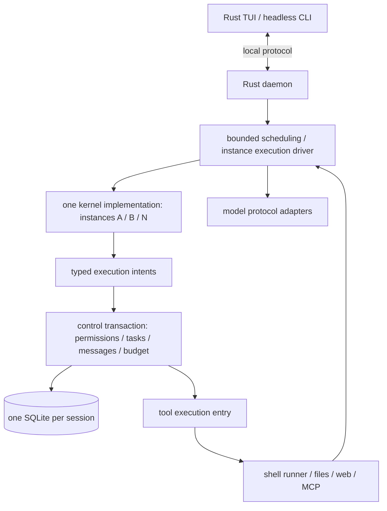

# TeamAgents design and acceptance baseline

This file is the design basis of the current implementation: the confirmed product requirements, the
architecture and protocol constraints, the engineering choices, the A01–A36 acceptance matrix and the
definition of done. The confirmed direction and scope are in [DECISIONS](DECISIONS.md), per-item evidence and
known gaps in [ACCEPTANCE](ACCEPTANCE.md), and the conventions and commands in [DEVELOPMENT](DEVELOPMENT.md)
and [AGENTS](../AGENTS.md).

It separates three kinds of statement: requirements the user confirmed; engineering choices with reasons; and
assumptions that only probes or real evaluation can settle. The item-by-item reasoning, alternatives and
falsification conditions were argued in the 45-item design review (removed from the tree with the archive
cleanup; reachable through `git log -- review/archive`). Language, framework or line count never prove a model
performance gain.

## 1. Confirmed requirements and delivery scope

| # | User-confirmed | Implementation constraint |
|---|---|---|
| Q1 | Task success rate and long-horizon reliability at the same model and budget matter equally | Success rate, wrong completions, recovery correctness, cost and duration all count |
| Q2 | Language and component boundaries may change if the design argues the choice | Free choice at the time; the user then selected the Rust-native architecture |
| Q3 | Scope may be re-cut; deliver the kernel and the runtime first | Capabilities added to the first release are listed in Q6, Q12 and Q13 |
| Q4 | Context, message and tool access are isolated by default; full_auto shell may bypass the logical boundary | Permissions are enforced at runtime; context isolation is never advertised as a security boundary between host processes of the same user |
| Q5 | The Leader manages instances and connections by default and may delegate part of that authority | Authorized instances may communicate directly; instances never chat privately, collaboration goes through control-plane-granted messages and shared space |
| Q6 | The first usable release ships a TUI with conversation, status and task control | Headless entry points may come first internally; the first public release includes the TUI |
| Q7 | Closing the UI keeps work running, and the user can reconnect and intervene | The background runtime is independent of the front-end lifetime |
| Q8 | The user talks to the Leader by default and may read other instances' history, talk to them directly, pause or cancel | The user has a global view; agents stay isolated from each other by permissions |
| Q9 | Instances are reused and retained within a session; they can be terminated or reset; sessions are isolated by default | Instances, tasks and turns have separate lifetimes |
| Q10 | Work continues by default; the user may set a goal budget; permanent failures and repeated failures are handled in a bounded way | No short implicit goal timeout; retries, concurrency and resource use are still bounded |
| Q11 | Required checks must pass; other claims carry evidence and unverified items; independent review happens on demand | A failed acceptance enters a repair loop; no extra review instance is forced per task |
| Q12 | The first release ships basic tools, MCP and Skills; no external Codex adaptation | Basic tools mean files, terminal, web search and fetch; the new execution core keeps no external Codex backend |
| Q13 | Multiple providers, mixed models inside one team; DeepSeek is the main acceptance baseline | DeepSeek V4.1 Flash uses its native 1,000,000 context; other models use theirs |
| Q14 | The project workspace is shared by default; isolated directories or Git worktrees on demand | The shared project is an explicitly granted resource; private conversations are not shared with it |
| Q15 | Authorized work resumes after a restart; an unknown outcome is verified first and parked with a notification if it stays unknown | Operations that may already have had an effect are never replayed blindly |
| Q16 | Single-instance behaviour must not regress and collaboration must show a reproducible gain on a pre-defined task set; official scores are a reference | Controlled ablations and complete new runs, never a splice of historical bests |
| Q17 | Estimate usage cost on a small scale before setting the full multi-round budget | The pilot diagnoses and estimates cost; it never justifies a statistically significant claim |
| Q18 | No compatibility with old configs or sessions is required, and old data may be cleaned up | The new format and directory layout are designed directly, with no migration duty |
| Q19 | Clean up old sessions, state, caches and configs; keep credentials, raw evaluation records, review evidence and Git history | Cleanup follows an explicit inventory of TeamAgents-owned data (see §14 of the archived plan) |

The user then selected the Rust-native architecture explicitly, replacing the earlier idea of LangGraph owning
persistence. A team of one, governed communication, arbitrary connection topologies, a small model loop and
long-horizon stability remain in force. D-41's semantics stay: full_auto uses the host shell, a service started
by a successful command survives, timeout/cancellation stops the command's process group, and model credentials
never enter the tool environment automatically; `approved_scope` keeps using bubblewrap.

The first release targets a single machine and a single system user; the TUI, basic tools, MCP, Skills,
multiple providers and on-demand multi-instance behaviour are all part of it. Distributed execution,
multi-tenancy, cross-session automatic memory, an external Codex backend and a plugin marketplace are out of
scope. The user may read any instance's history; that grants no equivalent permission to other agents.

## 2. Overall design after the decision review

| Item | Choice | Reason and boundary |
|---|---|---|
| Language and framework | Rust for the product; no LangGraph or another agent harness | Confirmed by the user; avoids maintaining a second execution and storage semantics, and any performance gain still has to be measured |
| Kernel | a small, I/O-free state-transition module | Models see tools and instructions directly; network, persistence and permissions never enter model decision logic |
| Execution | a purpose-built finite state machine; the logical instance is separate from any thread | The execution loop is finite, so a general graph interpreter is unnecessary; the price is owning recovery correctness |
| Concurrent I/O | Tokio with an async HTTP transport; blocking work isolated with a bound | Service connections, model streams, timers and cancellation share one model; Tokio is the I/O executor and never owns business state |
| Persistence | one SQLite database per session owning tasks, execution position, message consumption and operation receipts | Removes the old two-database coordination; a session is the default isolation and cleanup unit, with no cross-session transactions in the first release |
| Large content | an append-only history index plus immutable artifact references | Avoids copying the whole 1M history per step and avoids building a full event-sourcing framework |
| Processes | one user-level daemon, front-end clients, on-demand shell runners | The daemon is independent of the TUI; an instance is not an OS process; short ordinary tools need no process of their own |
| TUI and protocol | Rust/ratatui plus versioned JSON over a Unix socket | The existing interface and single-machine deployment fit this boundary; no network RPC, microservices or per-instance sockets |
| Project structure | three crates (`core`, `engine`, `tui`) with responsibility-based boundaries | Modules express responsibility well enough; no crate or generic plugin interface per concept yet |

The TUI reaches the engine through the daemon socket ([daemon_client.rs](../tui/src/daemon_client.rs)); the
daemon owns the connection transport and the session lifetime, so quitting the TUI does not stop the session
and a reconnect resumes events from the watermark. The shell contract, the UI geometry and the protocol-parsing
tests all follow that same convention.

Async I/O costs extra dependencies and a transport layer, so it must show measurable cancellation and
shutdown behaviour: Tokio's already-started `spawn_blocking` work cannot be aborted, and cancelling a shell
command must go through real process management (the runner process group in `engine/src/jobs`).
[Tokio docs](https://docs.rs/tokio/latest/tokio/task/fn.spawn_blocking.html)

## 3. Kernel, instances and the execution contract



The kernel is an implementation; `KernelInstance` carries identity and private context. The Leader, working
instances and short-lived helpers share one kernel, and a role is expressed through instructions and
capabilities. A short-lived helper may report only to its creator but still uses the same execution, receipt
and budget machinery.

The communication topology is validated data and may contain directed cycles; it does not determine the
execution control flow of any instance. There is no single completion barrier across instances, and a retained
instance occupies no thread or model slot. One instance may take on several goals in sequence, with every call
belonging to exactly one goal; cross-goal messages are explicitly correlated and a later message never
reassigns the budget attribution of an in-flight request.

The kernel's suggested interface: `prepare_request(ContextView)`, `interpret_response(ModelResponse)` and
`apply_observation(Observation)`, producing `ModelRequest / ToolIntents / Reply / Wait / CompletionCandidate`.
These are interface boundaries, not a demand for five traits or five services. Every identity, operation id,
permission revision and delivery sequence is filled in by the runtime.

| Persisted execution position | Next step | Normal transition |
|---|---|---|
| `READY` | consume admitted input or the last tool result and build the request | after fixing the request and reserving budget, enter `MODEL_PENDING` |
| `MODEL_PENDING` | issue or verify one model attempt | a complete response enters the context and atomically registers tool intents, a wait or a completion request |
| `TOOLS_PENDING` | dispatch or collect tool results for the fixed intents | back to `READY` once the required receipts are in |
| `WAITING` | wait for a task, job, approval, user input or timer | when the condition holds, atomically register a ready intent |
| `COMPLETION_PENDING` | verify the completion request and the required checks | pass → finish the goal/task, otherwise return to `READY` with a reason or park |

`PAUSED / PARKED / TERMINATED` describe instance runnability and no longer duplicate every execution position
in one state enum. Task results use their own `PENDING / RUNNING / BLOCKED / SUCCEEDED / FAILED / CANCELLED`,
and operations have their own real execution outcome. An instance may be paused while a task is cancelled and
an operation already succeeded; one status field never has to cover all of it.

Work only advances with an unfinished goal or newly admitted input. Before a model call, before a tool
dispatch and after consuming a result are the control-safe boundaries. The driver yields on bounded batches and
introduces no hidden graph-step or turn-lifetime cap on a user goal. An ordinary chat reply never settles a
task; only a `CompletionCandidate` starts the completion checks.

## 4. Storage, authoritative state and atomic boundaries

### 4.1 One database per session

Each session stores instances, tasks, execution positions, the conversation index, message deliveries,
capabilities, approvals, budgets, model attempts, tool operations and the event outbox in `session.sqlite`; the
separate `checkpoints.sqlite` is gone. Configuration files hold deployment settings and credential references
only, and both in-memory queues and TUI caches can be rebuilt from persisted facts.

The control entry `submit(command, trusted_identity)` runs a short transaction. Network calls, model requests,
shell commands, content hashing and large file writes all happen outside it, while object revisions and current
permissions are checked inside. Only one instance driver may write a given context at a time. Write requests
for one session are serialized and reads use bounded snapshots; no database connection holds a transaction
across a model or tool wait.

Synchronous SQLite calls go into a bounded storage work queue and never block async I/O threads; a full queue
applies explicit backpressure. Cancelling a future that waits for a transaction does not undo a committed
command, and the caller re-queries by `command_id`. Neither control entry nor transaction results consume a
model concurrency slot.

SQLite WAL allows concurrent readers and one writer, but several databases are still never one atomic
transaction. [SQLite WAL](https://sqlite.org/wal.html) The first release keeps the single writer and the
same-database atomic boundary instead of splitting databases and adding a coordination protocol later.

The minimal data contract per session follows; table names may change, but identity, ownership, version and
deduplication constraints may not. Every fact has exactly one authoritative representation, without an
"object, one service" requirement.

| Object | Key fields and constraints |
|---|---|
| Session | `id, project_root, leader_id, format_id, schema_version, status` |
| Instance / Execution | `id, profile_revision, workspace_ref, context_epoch, lifecycle, phase, revision, active_goal_id, active_request_id, context_head`; one executor per instance |
| Goal / Budget | `id, original_request_ref, requirement_revision, status, deadline, limits, known_usage, reservations, unknown_usage`; every child task references the same goal |
| Task | `id, goal_id, requester, assignee, dependencies, acceptance_refs, status, result_refs, revision` |
| CapabilityGrant | `id, issuer, subject, action, resource_scope, parent_grant_id, revision, revoked_at`; a channel only references grants |
| Envelope / ContextEntry | a message carries `id, sender, recipient, epoch, kind, correlation_id, payload_ref, sequence, state`; context is unique by `(instance, epoch, index)` and application is deduplicated by `(instance, epoch, envelope_id)` |
| ModelRequest / Attempt | `request_id, instance, epoch, goal_id, request_ref, selected_attempt_id`; an attempt carries `attempt_id, request_id, status, response_ref, usage`; a request selects at most one response |
| Decision / Operation | `decision_id, request_id`; an operation carries `operation_id, decision_id, tool_index, goal_id, epoch, args_hash, grant_revision, status, receipt_ref`; unique by `(decision_id, tool_index)` |
| Approval / Wait | an approval binds a concrete operation, its argument hash, the permission revision and a validity window; a wait binds an instance epoch, ALL/ANY conditions and an optional timer, and both have terminal states |
| ToolReceipt / Verification | a receipt binds the operation to its environment, output and real outcome; a check binds its declared sources/versions, the checker, the input artifact versions, the observation time and the evidence |
| CommandReceipt / Event | commands deduplicate by `command_id` and validate the payload hash; events carry a per-session increasing sequence plus permission scope and a payload reference |
| Artifact | `id, digest, size, kind, owner_scope, storage_ref, completeness`; file bytes are persisted before the database reference |

Each model attempt stores the effective configuration snapshot or an immutable version reference, and
credentials are stored as references only: a restart never silently changes the original request parameters
through an edited global profile.

### 4.2 Facts that must commit in one transaction

| Commit point | Atomic update |
|---|---|
| Admit input | the context append reference, the `(instance, epoch, envelope_id)` deduplication record, the message application acknowledgement and the execution position |
| Admit a complete model response | the unique response reference, the conversation append, the `decision_id`, the tool intents or completion request, and the settlement of known usage |
| Admit a tool terminal state | the unique operation receipt, the event for the instance to consume and the related task facts; the later consumption of the receipt and the context advance commit in the same database |
| Send a message / delegate | the business change, the message/task, the recipient's ready intent and the sender's action receipt |
| Register a wait | the wait conditions, the current completion check and any immediate wakeup intent |
| Complete a goal | the acceptance references, the open-operation check and the goal/task outcome plus external events |

That removes the earlier cross-database recovery branch of "the checkpoint advanced but the business database
did not confirm". A tool result may be recorded before it is consumed by the model, but the consumption itself
must deduplicate atomically.

### 4.3 Large context and write ordering

The conversation appends in order and an execution checkpoint stores the current phase, active request, open
operations and context head reference instead of copying the whole history every step. Old text is read on
demand and a compaction result carries a reference to its originals; each model request is built from the real
window with a stable cached prefix, so the same large string is not copied again for auditing.

Large outputs and complete responses become immutable artifacts, while small structured receipts stay in the
database. An artifact is written to a temporary file, verified, synced and atomically published before the
database reference commits; a failure may leave a collectable orphan file, and a database reference to
unpersisted bytes is forbidden. A streaming partial response has its own partial state and is never disguised
as complete. Hashes serve integrity and deduplication, never access control: reading across instances still
consults the resource ACL.

Publication first persists the artifact's identity, digest and owner as STAGING; the reference and the flip to
LIVE commit in the same transaction. GC first claims an unreferenced object as DELETING inside a transaction,
then refuses new references and only afterwards deletes the file, and a failed deletion can be retried. STAGING
is not collected for being temporarily unreferenced or for exceeding a fixed age: a restart verifies the
publication result and its owning request/job before importing or marking it ABANDONED, and an unimported job's
result directory is protected by that job. These are artifact lifecycle states, not a second business fact
store.

### 4.4 Durability strength and versions

Reliable state uses WAL with explicit `synchronous=FULL` on a verified local filesystem. The FULL/NORMAL
difference concerns durability across a system crash, so claiming a speed-up by weakening the sync strategy is
not allowed. [SQLite synchronous](https://sqlite.org/pragma.html#pragma_synchronous) UI token fragments may be
batched, but the before/after records of an important operation may not be dropped by such batching.

The selected SQLite must include the official WAL-reset fix (3.51.3 and the specific backports), verified
against the version the lock file actually links rather than the crate's declared version.
[SQLite fix notes](https://sqlite.org/wal.html)

Both schema and persisted state carry a version stamp: a foreign or wrong-version database is refused outright
(A34), and a later upgrade of this implementation needs an explicit migrate-or-refuse policy. WAL reclamation,
artifact collection and history retention are scheduled separately and protect live references and evaluation
evidence. A full disk stops new side-effect dispatch and reports honestly which in-flight results were not
persisted.

## 5. Identity, capability, communication and collaboration

### 5.1 A single authorization basis

The system keeps scoped `CapabilityGrant(subject, action, resource, parent_grant, revision)` records. A grant
can only narrow an existing scope, and revoking a parent invalidates its children. The Leader has management
capability by default and may delegate part of it; creating an instance grants neither arbitrary connections
nor blanket file permissions. The user manages and reads every instance, while the Leader cannot read another
instance's private history.

Communication edges are a projection of capability data, so there is no separately editable channel ACL beside
a grant ACL. A `channel_id`, when needed, references a grant and creates no second source of permission.
Messages, task return paths and shared resources are the three explicit communication mechanisms, and "may
observe" never means "must inject into the model".

The shared project directory counts as an explicitly granted resource, while isolated directories and
worktrees are created on demand. Files in the shared project are readable by authorized instances anyway, so
the design never claims that all information must pass through messages. full_auto's host shell keeps the
logical isolation boundary the user accepted.

### 5.2 The model-visible surface

Basic file, terminal and web tools are directly available. Collaboration keeps a small set of intuitive actions
(`spawn / delegate / send / wait / finish`); an ordinary `spawn` can atomically create an instance, register its
initial task and its required return path, avoiding the mechanical "create profile, create instance, connect
edges, dispatch". Advanced management appears per permission, and large MCP catalogs and Skills are discovered
on demand.

No fixed tool count is treated as a KPI and no giant JSON router swallows every tool. Evaluation records the
initial schema tokens, invalid calls and redundant management turns, and uses them to judge whether a
simplification really lightens the model's load. Neither instance count nor using collaboration enters a
success score.

### 5.3 Delivery, wakeups and revocation

A message is reported accepted only after it is persisted, and a recipient applies a context change exactly
once per envelope id. Recovery may re-read pending work but never re-applies it. Inboxes are bounded and apply
backpressure instead of dropping silently; status notifications may coalesce, but task results and user
messages are never silently overwritten. A message receipt does not, by itself, trigger a model reply.

Authorization is re-checked at both the send and the actual application boundary; revocation can block a
message that has not been applied but cannot unread content already seen. A task result has a narrow return
capability, enough to settle the existing task without adding a general reverse channel, and the return content
is delivered only to a still-valid, authorized recipient identity.

The communication graph may contain cycles while explicit task dependencies may not. Wait detection considers
ALL/ANY conditions, timers and external jobs, and finding a cycle in the graph is not by itself proof of a
deadlock. Only a closed set with no runnable or externally-fulfillable path is reported as blocked, and tasks
are never cancelled automatically. Registering a wait and checking "has the result already arrived" happen in
one transaction, so a wakeup is never lost.

### 5.4 Lifecycle and user intervention

Instance ids are never reused; a reset bumps the context epoch and invalidates old execution input. Termination
explicitly deals with the instance's open tasks and derived grants instead of deleting a member row. A late
receipt of a terminated instance still counts against the original operation and budget and is never injected
into a new instance's context.

User input enters the target instance at a safe boundary; directly adjusting a worker's task notifies the
relevant delegator of the state change, and a private conversation is never forwarded automatically. Role,
model and workspace changes apply at the boundary of the affected instance. Revocation blocks later dispatch
and makes no promise to undo a side effect that already started.

## 6. Side effects, tool processes and recovery

### 6.1 Pre-execution protocol

Every external tool uses a stable `operation_id` bound to `decision_id + tool_index`, the argument hash, the
instance epoch and the permission revision. States distinguish PREPARED, DISPATCH_COMMITTED, RUNNING, terminal
states and OUTCOME_UNKNOWN. Committing the dispatch is the linearization point of the authorization check:
revocation afterwards issues a cancellation request and never rewrites an authorized in-flight operation into
one that never started.

An OS file lock guarantees one coordinator per state root, and the lock descriptor is never inherited by tool
child processes. An instance has one in-memory execution slot, and revisions in the database detect late
results. The first release adds no distributed lease, no clock-based takeover and no forced takeover at an
arbitrary moment.

### 6.2 The necessary scope of the shell runner

Shell commands use an internal runner subcommand of the same Rust binary, one controlled runner per active
command. It is independent of the daemon's lifetime, holds the execution lock for its job id, and records the
start handshake, process identity, output and terminal state. Ordinary file reads and short transactions need
no runner, and an external MCP request gains no recoverable remote semantics merely because it passes through a
local process.

Start order: register the intent → the runner takes the unique job lock and reports READY → the daemon commits
the dispatch authorization → a GO carrying the operation id is sent → the runner persists the accepted marker
and starts the command. A duplicate GO never starts a second command. If the runner crashes between accepting
GO and recording the start, "no PID" is not evidence of non-execution: it is verified as an unknown outcome.

The runner serializes GO/CANCEL for one job. A cancellation before the command started is accepted by
persisting CANCELLED_BEFORE_START first and confirming the cancel afterwards; that terminal state permanently
refuses a late or replayed GO. Once GO crossed the start boundary, cancellation becomes a stop request, and the
real side effect and the stop confirmation are recorded separately. Recovery reads the latest control state for
the goal/task/operation, sends CANCEL for a cancelled operation, and never re-sends GO merely because the state
is DISPATCH_COMMITTED.

The runner stores the job token, PID, start time and system boot identity; while alive it may use Linux process
handles as an aid, but after a restart everything is re-verified, because a PID alone does not prove identity.
The terminal receipt is saved atomically first and imported into SQLite by the daemon afterwards; the runner
never concurrently edits the whole team database.

The runner is detached from the front-end/daemon terminal lifetime, closes descriptors it should not inherit
and writes to its own controlled log. How a service started by a successful command is treated follows D-41,
and a still-open pipe must never delay the recognition of a finished command. cwd/exports are stored per
instance and permission mode, and recovery takes the state from verified receipts instead of mixing another
instance's shell environment.

Tool calls inside one model response run in order by default; only known-independent read-only calls or
explicitly isolated operations run in parallel. A controlled write to a shared file checks the expected version
and returns a structured conflict error, because a shell command's full read/write set cannot be inferred from
its text. Cross-instance concurrency is governed by explicit delegation and resource constraints, and the
design never promises that every external write to a shared workspace is serialized.

### 6.3 Recovery matrix

| Persisted fact found | Recovery action |
|---|---|
| A user command was recorded but the client saw no reply | return the same receipt by `command_id`; do not resubmit |
| A model request was registered without a complete response | record that double billing and unknown usage are possible; re-request under the unified retry policy |
| A complete model response was published as an artifact but not imported | verify by `request_id` and import once with the same `decision_id` |
| A tool is PREPARED with no dispatch commit | re-check the current permission/budget and allow the first dispatch |
| The dispatch is committed and the runner is waiting or running | reconnect to the same job, deduplicate a repeated GO or keep waiting; never open a new job |
| An operation crossed the execution boundary and cannot be verified | OUTCOME_UNKNOWN: park the related tasks and notify; never redo blindly |
| A result is in the database but the instance has not consumed it | atomically append the receipt reference and advance the execution position without calling the tool again |
| A permanent error such as a missing executor | keep the input, park and deduplicate the notification; resume only on a fix or an explicit retry |
| A system restart made the original process disappear | verify receipts and external state; a vanished process does not prove that no side effect happened |

Same-database transactions settle internal consistency and cannot pull shell commands, MCP or external APIs
into one SQLite commit. What is promised is reuse of known results, deduplicated internal application and
honest parking of unknown outcomes; exactly-once semantics for arbitrary external operations are not promised.

### 6.4 Pause, cancellation and shutdown

Quitting the UI only drops the connection. Pausing stops new dispatch while in-flight actions either wait or
are explicitly cancelled, and the UI distinguishes "pause requested" from "stopped at a safe boundary".
Cancellation is persisted first and only then sends a process-group stop request to a controlled job; a call
that times out or an external request that cannot be cancelled keeps its unconfirmed or unknown state.

The persisted-first rule applies to a healthy store. When a write fails, new dispatch for the affected
execution freezes while a separately identity-verified control path still tries to stop controlled jobs, and
the report separates "was the cancellation saved" from "did the process stop". Output limits and control
resource reservations reduce the risk of running out of storage but cannot guarantee that a cancellation can
still be saved under arbitrary I/O failures. A restart re-verifies recoverable cancellation markers and runner
receipts, and when all persistent storage is gone it states plainly that unsaved cancellations cannot be
guaranteed across a restart instead of reporting a stopped process as a persisted cancellation.

A normal daemon shutdown freezes new dispatch, persists pending work and then stops itself; already dispatched
runners stay verifiable and continue after the target restarts. Stopping an in-flight job requires an explicit
cancel option. Under D-41 a service left behind by a successful command is not implicitly cleaned up when the
UI or daemon stops; stopping it is done explicitly as the task requires, and dropping a Rust future never
counts as having stopped an external program.

## 7. Models, tools and context

The protocol layer is separate from the vendor name: the reusable parsing and contract samples of Chat
Completions, DeepSeek extensions, Anthropic and Responses are kept, and each is accepted with a real service
separately. Authentication reads environment or machine credentials, and deployment settings store references
only. Opaque provider fields are stored with their origin and version, and never flattened through a lowest
common denominator that loses reasoning or tool-correlation information.

Only a complete model response yields executable tool intents, and half a stream remains an unfinished attempt.
Exactly one component owns retries: transport retries and the model's own repair commands are counted
separately. A provider switch applies at a safe boundary, and incompatible fields continue through their own
handover summary into the new epoch instead of forwarding old native blocks.

The logical `request_id` and each transport `attempt_id` are recorded separately. When an old attempt returns
late after a retry, the atomically selected response advances the request, while other complete or partial
responses are archived and billed without producing tool intents. Two random samples of one request are never
both applied to the context.

The request window uses the model's native length, 1,000,000 for DeepSeek V4.1 Flash. Capacity accounting
includes system instructions, tool schemas, history, output and protocol reserves; an unknown window requires a
reliable configuration and never defaults to 16K or 64K. Compaction follows real occupancy rather than an
arbitrary small window and keeps the original request, user revisions, acceptance criteria, open questions and
receipt references. The gain of a compaction algorithm is measured separately, and reducing the real window is
never dressed up as an optimisation.

A shell receipt carries whether the command actually started, the execution mode, cwd, exit code or signal,
duration, output reference and the cancel/timeout reason. A failed isolation start is not a non-zero exit, and
full_auto and approved_scope keep separate working directories and environments. Verification runs in the same
real target environment. A tool is available only when the current identity is allowed to execute it, and an
environment failure is never probed by creating another instance with the same capability.

MCP executes through the same permission, approval, budget, cancellation and receipt entry points; a server's
idempotence annotation is a hint and never authorizes an automatic replay
([MCP annotation trust boundary](https://modelcontextprotocol.io/specification/2025-06-18/server/tools)).
Skills register under `~/.agents/skills` and their bodies are searched and read on demand; a skill's
instructions can never widen execution permissions. A missing web-search credential or an unavailable tool is
reported as a capability state, and no executable binding is invented.

## 8. Budget, progress and completion checks

The goal budget covers every instance, model attempt, retry, compaction and verification, and delegation never
duplicates it. Without an explicit budget work continues; every network request still has stall detection and a
permanent error still parks. Reservation before a request, settlement from real usage and unknown usage are all
kept, parallel reservations never exceed the known remaining budget, and incomplete provider billing is never
turned into a false promise that the ceiling can never be exceeded.

Concurrency, job count, queue capacity and log capacity are resource configuration. Before publishing a
default, measure at least the 1/4/16 active-request load points on the reference machine. User control and
result handling never wait for a model slot, the interactive ready queue has priority with fairness, and any
reserved capacity records its throughput cost.

The system recognises duplicate deliveries, permanent start errors and high-frequency retries of the same
infrastructure failure, and handles them within bounds. A semantic "no progress" is usually only a hint:
re-running a test may be a legitimate repair, so no failure is declared from identical commands or a fixed
round count. The model is given the real remaining time and error summaries so it can change course, while the
user's budget and explicit stop conditions stay authoritative.

At completion the model states once, clearly, an `outcome + summary + evidence/unverified`; the runtime
automatically links the existing check receipts instead of demanding a large ledger from the model. An ordinary
question needs neither an artifact nor a review instance. Required checks defined by the user or project must
pass; conditions the model extracts from natural language carry their source and never masquerade as a
machine-checked contract the user confirmed item by item.

Cancelling an implementation subtask never deletes the original goal's requirements. A failed check enters
repair or BLOCKED, and a summary admitting non-delivery can never land as success. A check binds its declared
inputs, artifact versions and observation time, related hashes are re-verified before completion, and a
time-sensitive service is re-probed. Shared directories and external systems have no global lock, so the design
never claims to detect every undeclared dependency or to offer an atomic snapshot of the world.

Independent review receives the original request and artifacts on demand and may overturn the implementer's
assumptions; repeated agreement from the same model is not objective verification. Correctness without an
executable oracle is labelled with its real evidence strength instead of being blessed by one more model round
declaring the system proven.

## 9. Background protocol, interface and observability

`teamagents` opens the Rust TUI and attaches to the current user's daemon; `exec` is a headless client of the
same backend. The directory holding the Unix socket is restricted to the current user, and the startup lock and
protocol handshake distinguish an old service, a different state root and an incompatible version. No second
execution engine is opened inside the TUI.

Requests carry `protocol_version, request_id, method, params`, and business commands additionally carry a
`command_id` that is stable across reconnects. Events carry a session, a sequence, a type and a visible payload
reference. A reconnect first reads state and its event watermark in one read snapshot and then reads events
above that watermark; an already reclaimed watermark asks for a fresh snapshot. A streaming preview is not an
authoritative fact: a slow client may drop previews and re-read, and it never blocks database writes or loses a
business result.

The first release's methods are organised around sessions/goals, instances, task and permission views,
approvals and unknown outcomes, model configuration and trace export. Rust DTOs are the single source of the
protocol structure and export schemas/samples for client contract tests; the TUI stays a thin client over the
daemon socket JSON protocol rather than duplicating two large domain models, and whether to extract a shared
lightweight protocol crate follows real sharing needs.

The TUI keeps the existing input, rendering and geometry hit-testing implementation and completes instance
switching and history, tasks/grants/channels, approvals and unknown outcomes, budget usage, pause/resume/cancel
and disconnect/reconnect. The topology is expressed as an edge list first, so no graphical canvas is a
dependency of execution correctness.

Traces are complete but organised by reference and increment: every request/response, tool argument/receipt,
retry, compaction, control action and usage record carries a stable identifier and a timestamp, and the
interface only renders previews. Credentials and authentication headers never enter logs; provider-native
responses and complete visible content are stored per instance permission and exported in redacted form. A
truncated UI log never truncates model input, and raw confidential traces are never shared with every instance.

Retention treats active recovery data, ordinary history and evaluation evidence separately. Ordinary history is
archived or cleaned per user configuration and never copied in full at every step, while live references and
evaluation evidence are never evicted automatically. Unknown costs, missing stream fragments and unavailable
provider reasoning fields are all labelled honestly.

## 10. Module organisation and dependencies

```text
core/src/
  kernel/        # I/O-free request construction and response/observation conversion
  models.rs      # shared identity, config and catalog types
  v2/            # per-session single store, the trusted control transaction, v2 command models
engine/src/
  v2/            # driver (phase machine), supervisor (multi-instance), storage worker, daemon, exec client
  jobs/          # shell runner, start handshake, output and receipt verification
  tools.rs       # built-in tools and the unified operation entry point
  hooks.rs       # [hooks] notify and pre_tool
  bound.rs       # member tool bindings (binding is the authorization)
  mcp.rs         # MCP client (stdio and streamable HTTP)
  providers/     # protocol adapters and streaming transport
  workspace.rs   # workspace policies (shared / isolated / git worktree)
  config.rs      # configuration, capability catalog and credential references
  cli.rs         # init, doctor, daemon, exec, version
  reference.rs   # direct reference loop used by evaluation group A
  observability/ # traces, usage and evaluation export
tui/src/         # v2app (state and keys), v2ui (rendering), daemon_client, text, wrap
verification/    # TLA+ specs and the Kani proof crate
review/eval/     # fixed-task runner and its raw evidence
```

This is a responsibility map; files may be merged where the real size allows and no noun is mechanically
turned into a trait. The `core/src/kernel` interface exposes no database connection, global registry or network
handle. Storage, protocol and tool implementations follow behaviour contracts and make no promise of
compatibility with an older state format.

The existing foundations stay: serde, rusqlite, UUID, SHA and ratatui. Async HTTP and the Unix process
interface use a minimal dependency set recorded in the lock files, and two production HTTP stacks are never
kept for the same behaviour. Tests and performance probes may use Python, but the product kernel/runtime does
not depend on Python, and the single `make` entry point stays.

Modules are divided along contract boundaries, reusing proven parsers, permission rules and shell semantics;
replaced implementations and their tests are deleted together, no compatibility literal survives, and a green
suite is never manufactured by deleting failing cases.

## 12. Acceptance matrix

| # | Scenario | Acceptance result |
|---|---|---|
| A01 | one Leader completes a goal | every basic tool works, with no forced team or extra review instance |
| A02 | A→B→C→A communication | delivery on a granted channel, executions independent |
| A03 | limited delegation and parent revocation | scope cannot widen and derived grants expire correctly |
| A04 | a queued action meets a revocation | re-checked and refused before the linearization point; in-flight actions have explicit cancellation semantics |
| A05 | an agent reads another instance's history | the controlled entry refuses it while the user may look; full_auto claims no strong isolation |
| A06 | a message applied across a restart | no message or context lost and no duplicate application |
| A07 | permanent start failure | input kept, one notification, parked, no turn storm |
| A08 | crash after a tool succeeded but before model consumption | the same result is reused and no side effect repeats |
| A09 | unknown external outcome | related tasks park and notify while independent tasks continue |
| A10 | duplicate dispatch/GO for one job | at most one authorized executor; an unverifiable start is never guessed as "not executed" |
| A11 | daemon and runner crash separately | reconnect when verifiable, otherwise record unknown; never restart just because a PID is missing |
| A12 | a shell service outlives a CLI/TUI exit | keeps D-41's semantics for services started by a successful command |
| A13 | cancel, timeout and completion races | one operation terminal state; cancellation never overwrites a real effect that happened |
| A14 | bubblewrap unavailable | a classified `started=false` failure with no silent host fallback |
| A15 | inconsistent environment | verification runs in the real target environment and environment identity is traceable |
| A16 | a required check fails or a deliverable is missing | no success; feedback into repair or BLOCKED |
| A17 | artifacts change after a check | declared dependencies are invalidated; the actually verified version and the limits are reported |
| A18 | multi-instance usage with retries and compaction | one shared goal budget with visible reservations and unknown cost |
| A19 | half a model stream and connection loss | incomplete tool arguments never execute; retries and cost are recorded honestly |
| A20 | restart after long-context compaction | requirement revisions, acceptance criteria and open items survive, originals stay addressable |
| A21 | the user adjusts a worker directly | single-writer context, task affiliation preserved, the parties involved notified |
| A22 | ALL/ANY wait cycles and external timers | an ordinary cycle is not mistaken for a deadlock; a genuinely closed wait is diagnosable |
| A23 | a result arrives before the wait is registered | no lost wakeup and no busy polling |
| A24 | a late result after an instance reset | it counts against the old operation/budget and never enters the new epoch |
| A25 | MCP approval, cancellation and unknown outcome | the same contract as basic tools, with no reliance on annotations for remote idempotence |
| A26 | a Skill asks for wider permissions | permissions are unchanged and on-demand loading works |
| A27 | instances on different providers cooperate | required native fields survive and only granted content is shared |
| A28 | UI disconnect, slow client, reconnect | work continues, the snapshot watermark is correct and commands deduplicate |
| A29 | a new session with a shared project | session history is isolated and project resource sharing is explicit |
| A30 | artifact and DB write boundaries | no reference to unpersisted artifacts and orphan files stay collectable |
| A31 | write failure / disk full | new side-effect dispatch stops, uncertainty is preserved and success is never faked |
| A32 | very large history with multi-instance reads | no full copy per step and measured RSS/disk/latency records |
| A33 | two daemons and an inherited stale lock | one coordinator only, and tools never inherit the coordinator lock in a way that blocks recovery |
| A34 | an incompatible schema in a new version | migrate explicitly or refuse; never keep executing on a misinterpreted state |
| A35 | the evaluation client expires or is killed | the daemon honours the goal deadline and the answer is not extended during grading |
| A36 | install, init, doctor, cleanup and reopen | old and new directories are identified correctly, credentials and evidence are kept, new work runs normally |

A19 also covers an old attempt returning after a newer one: only one response produces execution intents.
A17/A29 cover controlled file-write version conflicts, and concurrent shell effects are reported from real
receipts. A28 covers re-querying a committed command after the client's wait was cancelled, and rebuilding a
snapshot once the event watermark was reclaimed.

A10/A11/A13 add CANCEL→GO, GO→CANCEL, repeated control and a refusing start after a restart. A30 adds
publication/GC interleavings, a new reference after a GC claim and protecting unimported runner results; A31
adds a failed cancellation save that still stops the process best-effort and reports the process stop and the
persisted state separately.

Deterministic kernel/protocol behaviour is covered by sample tests, SQLite and process recovery by real
processes, shell/bubblewrap by the real environment, and the TUI by logic tests plus PTY. At least one real
mixed-provider path (DeepSeek plus another provider) is verified; providers without credentials are listed as
unverified, and fake services never stand in for real conclusions. `make check` stays the single development
entry point, while a full delivery additionally runs PTY, fault and authorized real-model acceptance.

## 13. Performance experiments and success criteria

### 13.1 Local cost and model success rate are verified separately

Local cost experiments use fixed responses/tool receipts with equivalent persistence and recovery guarantees
and measure CPU, RSS, request construction, database writes, control response and restart time. They answer
system-efficiency questions and never score model capability.

| Model group | Composition | Question it answers |
|---|---|---|
| A: lean single-instance reference | the same Rust kernel, model protocol, tools, context and acceptance policy; a direct loop with no team management | individual capability on a reliable toolchain |
| B: persistent single instance | the same kernel plus the persistent runtime, one instance | whether the machinery changes request/tool behaviour or harms success |
| C: collaboration on demand | B plus the visible collaboration surface, allowed to stay a team of one | the net gain of the system choosing to collaborate |

A and B keep what the model sees equivalent, with dynamic ids normalised for comparison; C's collaboration
instructions and schema are the experimental treatment and are billed. A carries no production recovery
promise, so an A/B model ablation cannot replace a same-reliability local cost comparison. The reference loop
exists for evaluation only and never becomes a second production kernel.

These three groups answer single-instance and collaboration questions for this system. Claiming to beat an
existing baseline requires a comparison run under the same budget with the non-alignable factors recorded;
scores from different sources are never spliced into a causal conclusion.

The main experiment uses DeepSeek V4.1 Flash at its native 1M with every instance sharing one goal budget. The
effective model parameters, task digests, image, actual working directory, time limits, resources, network
policy and sampling are frozen. Actual cost and duration are reported, and identical ceilings are never
presented as identical spending. Heterogeneous-model performance is reported separately.

### 13.2 Samples, budget and integrity

A development subset and the formal set are established first, with task properties, grouping, repeat count and
the analysis script registered in advance. The earlier 89 tasks were used for diagnosis and can never be called
an unseen holdout set. A formal full score comes from a complete new run, and a collaboration subset is chosen
by pre-declared properties rather than by whether C succeeded.

The plan estimates cost with 6 tasks × A/B/C once (18 trials) to cover environment/service, long-command,
semantic-acceptance and splittable tasks, and then sets the budget from measured tokens, cache pricing, retries
and duration; a small mean is never treated as the tail bound. The 801-trial figure (89 tasks × 3 groups × 3
rounds) is an arithmetic example of a complete design, not a size this plan will run without a cost estimate.

The old 59/89 was a mechanical merge with answer exposure and is not a clean baseline. Its original analysis is
kept in Git history (removed from the tree with the archive cleanup). No hidden test or upstream solution is
ever handed to the executing agent. Network limits belong to the outer evaluation environment and never change
the everyday full_auto product semantics. Infrastructure retry rules are fixed in advance, and original
failures are kept instead of being overwritten by a favourable re-run.

Background mode especially must convey an evaluation's hard deadline: at expiry it stops new model/tool
dispatch and cancels in-flight controlled jobs, and a killed client cannot keep working on the answer. Before
formal grading, task writes are confirmed stopped; under D-41 the services a task needs stay up as its
requirements ask. Start failures, model errors, timeouts, verifier-environment errors and assertion failures
are reported separately.

The deadline is persisted on the goal and passed to the runner, which independently enforces the per-command
timeout; it never depends only on a surviving CLI or a daemon timer. The outer adapter verifies that the solver
process stopped; if a runner failure or a process that escaped its group makes that impossible, the run is
recorded as an infrastructure failure and no valid score is claimed from an environment that might still be
writing an answer. This rule adds no implicit goal deadline to ordinary tasks.

### 13.3 No more thresholds without evidence

The unsupported fixed rules are withdrawn: the "-2 percentage points" interval bound and "positive in at least
two of three rounds" from the earlier design. The −2pp value was about interval precision while the point
estimate also had to stay non-negative; without variance, sample size or cost evidence it cannot be an
acceptance threshold.

Before a formal experiment, the repeat count, paired analysis and required statistical precision are fixed from
pilot variance, task count and cost, producing a frozen manifest and analysis script. Repeats are aggregated
per task and the report shows per-round scores, paired differences and intervals; repeated runs of one task are
never treated as independent samples. A 95% interval may be the pre-registered analysis choice, but the
confidence level is never adjusted after seeing results.

Acceptance principle: B shows no observed regression against A with evidence strong enough to support the
conclusion, and C shows a reproducible cross-run gain over B on the pre-defined task set, while the full task
set is also checked for regressions, cost and duration. A non-significant difference is not proof of
equivalence; too few samples means "not confirmed". Any non-zero tolerance must be related to the "no
regression" requirement before the experiment and never slipped in afterwards.

Feature completeness, recovery correctness and performance gain are three independent conclusions: a feature
candidate may go to internal verification first, and an unmet performance target blocks declaring completion.
The official 90.6% is a configuration reference, never a score an architecture choice guarantees.

## 16. What still needs evidence, and the definition of done

Well-supported by requirements: the Rust-native direction, one unified kernel, governed communication, reliable
state and tool receipts, independent background operation and same-budget evaluation. Still needing evidence:
the cancellation/resource behaviour of the I/O approach, the exact SQLite version and throughput, the runner
handshake's fault coverage, real model-protocol compatibility, compaction strategy and collaboration gains, and
concurrency and cost defaults.

The decision review (removed from the tree with the archive cleanup) gave alternatives and change conditions per
item; it never claimed every design choice was proven optimal.

Definition of done: A01–A36 have automated evidence (uncovered items are listed in
[ACCEPTANCE](ACCEPTANCE.md)), performance conclusions follow the pre-registered criteria, installation and the
real terminal work, documentation matches the code, and `make check` is green.
