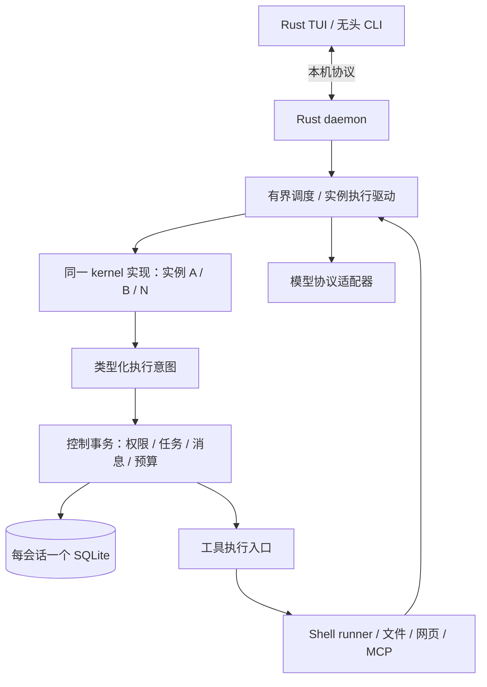

# TeamAgents Agent 系统重构方案（Rust 原生版）

日期：2026-09-23。修订：R2.1。状态：用户已确认产品需求及 Rust 原生架构，并授权开始 R2-P0；本修订纳入开工审查的三项契约，其他阶段仍待实施。P0 合约见 [R2-P0 执行合约](R2-P0-CONTRACTS.zh-CN.md)。

架构方向：**Rust 小型 kernel + Rust 持久化实例运行时 + SQLite + 独立工具进程管理 + Rust TUI**。替换 R1 的 Python/LangGraph 方案。确认记录见 [D-42](DECISIONS.md#d-42-rust-原生-agent-系统重构方向2026-09-23)。

本文区分三类内容：用户已确认的要求；本轮有理由支持的工程选择；必须通过 P0 探针或真实评测才能成立的假设。逐项理由、备选与反证条件见 [设计决策复核](../review/agent-system-design-review-2026-09-23.md)。语言、框架或代码量均不能直接证明模型性能提升。

## 1. 已确认需求与交付范围

| 编号 | 用户确认 | 实施约束 |
|---|---|---|
| Q1 | 同模型、同预算下的任务成功率与长任务可靠性并重 | 成功率、错误完成、恢复正确性、费用和耗时共同纳入验收 |
| Q2 | 允许调整语言与组件边界，由设计方论证选型 | 当时允许自由选型；随后用户明确选定 Rust 原生架构 |
| Q3 | 产品范围可重新取舍，先交付 kernel 与运行时 | 后续明确纳入首版的能力见 Q6、Q12、Q13 |
| Q4 | 默认隔离上下文、消息与工具访问权限；接受 full_auto Shell 绕过逻辑边界 | 权限在运行时实施；不把上下文隔离宣传为同用户主机进程间的安全隔离 |
| Q5 | Leader 默认管理实例与连接，可授予其他实例部分管理权 | 授权后的成员可直接通信；替换旧 D-33 的成员间直连限制 |
| Q6 | 首个可用版本提供 TUI，含对话、状态与任务控制 | 内部开发可先有无头入口；对外首版必须包含 TUI |
| Q7 | 关闭界面后任务继续，可重新接回并干预 | 后台运行时独立于前端生命周期 |
| Q8 | 默认与 Leader 对话，可查看其他实例历史、直接对话、暂停或取消 | 用户有全局操作视图；Agent 之间仍按权限隔离 |
| Q9 | 会话内按需保留、复用实例，可终止或重置；跨会话默认隔离 | 实例、任务和对话回合具有不同生命周期 |
| Q10 | 默认允许持续工作；用户可设目标级预算；永久故障和重复失败有界处理 | 不设置短的隐含目标超时；重试、并发与资源使用仍有约束 |
| Q11 | 必需检查通过；其他要求提供证据与未验证项；按需独立审查 | 验收失败进入修复循环；不强制每个任务额外创建审查实例 |
| Q12 | 首版提供基础工具、MCP、Skills；无需外部 Codex 适配 | 基础工具含文件、终端、网页搜索与抓取；新执行核心不保留外部 Codex 后端 |
| Q13 | 多供应商、实例间混用模型；DeepSeek 为主验收基线 | DeepSeek V4.1 Flash 使用原生 1,000,000 上下文；其他模型使用其原生长度 |
| Q14 | 默认共享项目工作区，按需独立目录或 Git worktree | 共享项目是显式授权资源；私有对话不随项目共享 |
| Q15 | 重启后自动续跑已授权任务；未知结果先核验，仍不明则停放并通知 | 不盲目重放可能已有副作用的操作 |
| Q16 | 单实例能力不退化，协作在预先确定的任务集上有可复现增益；官方分数作参照 | 采用受控消融和完整新跑分，不拼接历史最佳结果 |
| Q17 | 先小规模估算用量费用，再确定全量、多轮预算 | 首轮试跑用于诊断和成本估计，不据此宣布统计显著的性能提升 |
| Q18 | 无需兼容旧配置或续跑旧会话，并清理旧数据 | 新格式、新目录布局直接设计，不承担旧存储迁移续跑 |
| Q19 | 清理旧会话、状态、缓存、旧配置；保留凭据、评测原始记录、审查证据和 Git 历史 | 按明确清单清理 TeamAgents 专属数据，见第 14 节 |


用户后续明确选定 Rust 原生架构，取代“LangGraph 承担持久化”的早期设想。单人成队、受控通信、任意通信拓扑、简洁模型闭环和长任务稳定性继续有效。D-41 的 full_auto 主机 Shell、成功命令所启动服务存活、超时/取消终止本次命令进程组、模型密钥不自动进入工具环境等语义保留；approved_scope 继续采用 bwrap。

首版限定本机 Linux、单系统用户；TUI、基础工具、MCP、Skills、多供应商、按需多实例全部属于首版。分布式、多租户、跨会话自动记忆、外部 Codex 后端、插件市场不在范围内。用户可查看任意实例历史，这不赋予其他 Agent 相同权限。

## 2. 决策复核后的总体设计

| 项目 | R2 选择 | 理由与边界 |
|---|---|---|
| 语言与框架 | 产品实现使用 Rust；不引入 LangGraph 或另一个 Agent harness | 已获用户确认；避免为框架再维持一套执行和存储语义，性能收益仍须测量 |
| kernel | 无 I/O 的小型状态转换模块 | 模型看到的工具和指令保持直接；网络、持久化、权限不进入模型决策逻辑 |
| 执行 | 自研有限状态机；逻辑实例与实际线程分离 | 执行闭环有限，不需要通用图解释器；自研必须承担恢复正确性 |
| 并发 I/O | 推荐 Tokio 与异步 HTTP 传输；阻塞工作有界隔离 | 服务连接、模型流、定时与取消统一；Tokio 是 I/O 执行器，不管理业务状态 |
| 持久化 | 每会话一个 SQLite 数据库，统一任务、执行位置、消息消费和操作回执 | 删除原双库协调；会话是默认隔离和清理单位，首版不提供跨会话事务 |
| 大内容 | 追加式历史索引 + 不可变制品引用 | 避免每一步复制/保存完整 1M 历史；不设计全量事件溯源框架 |
| 进程 | 一个用户级 daemon、前端客户端、按需 Shell runner | daemon 独立于 TUI；实例不是一个 OS 进程；普通短工具不必全部进程化 |
| TUI/协议 | 复用 Rust/ratatui；Unix socket 上版本化 JSON | 已有界面和本机部署适合此边界；不用网络 RPC、微服务或每实例 socket |
| 项目结构 | 先保留 core/engine/tui 三 crate，重构内部边界 | 分模块足够表达职责，暂不为每个概念新建 crate 或通用插件接口 |

现有 TUI 已通过 JSON 协议访问引擎，见 [worker.rs](../tui/src/worker.rs)；连接传输和生命周期必须调整，不能直接沿用“前端退出即回收引擎”的行为。已有 Shell 合约、协议解析样本、事务及 UI 几何测试可复用；旧的调度、模型循环和状态组织需按新合约替换。

异步选择的代价是新增依赖及传输层适配。P0 对比有界阻塞 I/O 的取消和停机表现，验证采用异步方案的具体收益；协议解析逻辑可复用，不能把整个旧 ChatRunner 塞进异步任务。Tokio 已开始的 `spawn_blocking` 工作不能靠 abort 中止；Shell 取消必须走真实进程管理。[Tokio 文档](https://docs.rs/tokio/latest/tokio/task/fn.spawn_blocking.html)

## 3. Kernel、实例与执行合约



kernel 是实现，KernelInstance 是身份和私有上下文的载体。Leader、工作实例、短期助手共用一个 kernel；角色通过指令与能力表示。短期助手可以只向创建者回报，但仍使用同一执行、回执和预算机制。

通信拓扑是经校验的数据，可含有向环；它不决定实例的执行控制流。实例之间没有统一完成屏障。保留实例无需占用线程或模型调用槽位。同一实例可顺序承接不同目标，每次调用固定归属一个 goal；跨目标消息有显式关联，不能因收到另一条消息就改写在途请求的预算归属。

kernel 的建议接口：`prepare_request(ContextView)`、`interpret_response(ModelResponse)`、`apply_observation(Observation)`，输出 `ModelRequest / ToolIntents / Reply / Wait / CompletionCandidate`。这些是接口边界，不预设必须拆成五个 trait 或五个服务。所有身份、操作 ID、权限版本、投递序号均由运行时填入。

| 持久化执行位置 | 下一步 | 正常转换 |
|---|---|---|
| `READY` | 消费获准输入或上次工具结果，构造请求 | 固定请求与预算预留后进入 `MODEL_PENDING` |
| `MODEL_PENDING` | 发起/核对某次模型尝试 | 完整响应进入上下文，并原子登记工具意图、等待或完成申请 |
| `TOOLS_PENDING` | 按已固定意图派发/收集工具结果 | 所需回执齐备后回到 `READY` |
| `WAITING` | 等待任务、job、批准、用户输入或计时器 | 条件已满足时原子登记就绪意图 |
| `COMPLETION_PENDING` | 核对完成申请与必需检查 | 通过则完成目标/任务，否则带原因回到 `READY` 或受阻 |

`PAUSED / PARKED / TERMINATED` 是实例可运行性状态，不再复制一套包含所有执行位置的状态枚举。任务结果另用 `PENDING / RUNNING / BLOCKED / SUCCEEDED / FAILED / CANCELLED`；操作另有真实执行结果。实例暂停、任务取消、操作已成功可以同时成立，不能用一个 status 覆盖全部事实。

只在有未完成目标或新获准输入时推进。模型调用前、工具派发前和结果消费后是控制安全边界。执行器按有界批次让出调度权，不给用户目标引入隐藏的图步数/回合寿命上限。普通聊天 Reply 不自动结清任务；CompletionCandidate 才触发完成检查。

## 4. 存储、权威状态与原子边界

### 4.1 每会话单库

每个会话使用 `session.sqlite` 保存实例、任务、执行位置、对话索引、消息投递、能力、批准、预算、模型尝试、工具操作及事件 outbox。取消独立 `checkpoints.sqlite`。配置文件只保存部署设置与凭据引用；内存队列和 TUI 缓存都可以由持久化事实重建。

控制入口 `submit(command, trusted_identity)` 执行短事务。网络、模型请求、Shell、内容散列及大文件写入都在事务外；事务内检查对象 revision 和当前权限。后台只允许一个实例驱动者写同一上下文。每个会话的写请求串行化，读取采用有界快照；数据库连接不跨模型/工具等待持有事务。

同步 SQLite 调用放入有界存储工作队列，不能阻塞异步 I/O 执行线程；队列满时明确背压。取消等待某个事务的 future 不撤销已提交命令，调用方按 command_id 查询同一结果。模型控制入口和事务结果传递不占模型并发槽。

SQLite WAL 允许读写并行，但同一数据库仍只有一个写者，也不能把多个库视为一个原子事务。[SQLite WAL](https://sqlite.org/wal.html) 首版维持单写入口与同库原子边界，避免先拆库再补协调协议。

以下是 R01/R09 的最小数据契约；表名可调整，身份、归属、版本与去重约束不能省略。每类事实只有一个权威表示，不要求“一对象一服务”。

| 对象 | 关键字段 / 约束 |
|---|---|
| Session | `id, project_root, leader_id, format_id, schema_version, status` |
| Instance / Execution | `id, profile_revision, workspace_ref, context_epoch, lifecycle, phase, revision, active_goal_id, active_request_id, context_head`；同实例单执行者 |
| Goal / Budget | `id, original_request_ref, requirement_revision, status, deadline, limits, known_usage, reservations, unknown_usage`；所有子任务引用同一 goal |
| Task | `id, goal_id, requester, assignee, dependencies, acceptance_refs, status, result_refs, revision` |
| CapabilityGrant | `id, issuer, subject, action, resource_scope, parent_grant_id, revision, revoked_at`；Channel 仅引用授权 |
| Envelope / ContextEntry | 消息含 `id, sender, recipient, epoch, kind, correlation_id, payload_ref, sequence, state`；上下文唯一 `(instance, epoch, index)`，应用去重唯一 `(instance, epoch, envelope_id)` |
| ModelRequest / Attempt | `request_id, instance, epoch, goal_id, request_ref, selected_attempt_id`；尝试含 `attempt_id, request_id, status, response_ref, usage`；一个请求最多选择一个响应 |
| Decision / Operation | `decision_id, request_id`；操作含 `operation_id, decision_id, tool_index, goal_id, epoch, args_hash, grant_revision, status, receipt_ref`；唯一 `(decision_id, tool_index)` |
| Approval / Wait | 批准绑定具体操作与参数散列、权限版本和有效期；等待绑定实例 epoch、ALL/ANY 条件与可选计时器，均有终态 |
| ToolReceipt / Verification | 回执绑定操作及环境、输出和真实结果；检查绑定要求来源/版本、checker、输入产物版本、观察时间与证据 |
| CommandReceipt / Event | 命令按 `command_id` 去重并校验载荷散列；事件按 session 内递增 sequence，含权限范围和 payload 引用 |
| Artifact | `id, digest, size, kind, owner_scope, storage_ref, completeness`；文件先持久化再发布数据库引用 |

模型配置每次尝试保存有效配置快照或不可变版本引用，凭据只保存引用名。不能在重启时用已经修改的全局 profile 悄悄改变原请求参数。

### 4.2 必须同事务提交的事实

| 提交点 | 原子更新 |
|---|---|
| 接收输入 | 上下文追加引用、`(instance, epoch, envelope_id)` 去重记录、消息应用确认、执行位置 |
| 接收模型完整响应 | 唯一响应引用、对话追加、decision_id、工具意图或完成申请、已知用量结算 |
| 接收工具终态 | 唯一操作回执、供实例消费的事件、相关任务事实；稍后消费回执与推进上下文也在同一库原子提交 |
| 发消息/委派 | 业务变更、消息/任务、接收者就绪意图、发送方动作回执 |
| 注册等待 | 等待条件、当前完成状态检查、必要的立即唤醒意图 |
| 完成目标 | 验收引用、未结操作检查、目标/任务结果和对外事件 |

这样删除 R1 中“检查点已前进、业务库未确认”的跨库恢复分支。工具结果可以先入账再供模型消费，但消费本身必须原子去重。

### 4.3 大上下文与落盘顺序

对话按序追加，执行检查点保存当前 phase、活跃请求、未结操作和上下文头引用，不每步复制完整历史。旧文本按需读取，压缩结果带原文引用；按实际窗口构造本次模型请求，缓存稳定前缀，避免为审计重复复制同一大字符串。

大输出与完整响应存不可变制品，小型结构化回执留在库中。制品先写临时文件、校验、同步、原子发布，再提交数据库引用；失败时允许留下可清理的孤儿文件，禁止数据库引用尚未持久化的文件。流式未完成输出有独立 partial 状态，不伪装成完整响应。哈希用于完整性与去重，不充当访问权限；跨实例读取仍需查资源 ACL。

发布前先持久化制品身份、摘要与所有者，置为 STAGING；提交引用与转为 LIVE 在同一事务内完成。GC 先在事务内取得无所有者对象的 DELETING 状态，之后拒绝新增引用，再删除文件；删除失败可重试。STAGING 不因暂时没有引用或超出固定时间而回收，重启先核验发布结果与所属请求/job，再决定导入或标记 ABANDONED。runner 结果目录由对应未导入 job 保护。这些状态仅是制品生命周期，不是第二套业务事实库。

### 4.4 持久化强度与版本

可靠状态使用 WAL + 显式 `synchronous=FULL`，在验证过的本地文件系统上运行。FULL/NORMAL 的区别涉及系统崩溃后的持久性；不能靠减弱同步策略宣称提速。[SQLite 同步语义](https://sqlite.org/pragma.html#pragma_synchronous) UI token 分片可以批量发送，重要操作的执行前/执行后记录不能被这种批量策略省略。

P0 核对 Rust 锁文件实际链接的 SQLite 版本，而非只看 crate 版本。官方记录 WAL-reset 问题在 3.51.3 及特定回补版本修复，须选择包含修复的版本并复测；这不等于本轮已经证实旧数据受影响。[SQLite 修复记录](https://sqlite.org/wal.html)

Schema 和持久化 kernel 状态都有版本；旧 v1 会话不迁移，但新架构自身的后续升级需要明确迁移或拒绝打开策略。WAL 回收、制品回收和历史保留单独调度，保护活动引用与评测证据。磁盘满时停止新的副作用派发，并明确报告未成功持久化的在途结果。

## 5. 身份、能力、通信与协作

### 5.1 单一授权依据

系统维护范围受限的 `CapabilityGrant(subject, action, resource, parent_grant, revision)`。授予只能缩小已有范围；父授权撤销使派生授权失效。Leader 默认具备管理能力，可以下授；创建实例不自动授予任意连接或全部文件权限。用户可管理和查看所有实例，Leader 不能读取其他实例私有历史。

通信边是能力数据的投影，不再同时维护一张可独立修改的 channel ACL 和一张 grant ACL。若需要 channel_id，用它引用授权，不产生第二个权限来源。消息、任务返回路径和共享资源是三类显式通信机制；“可以观察”不等于“要注入模型”。

默认共享项目目录视为明确授予的资源；独立目录/worktree 按需创建。共享项目文件本来就可被获准实例读取，不能宣称只允许通过消息交换全部信息。full_auto 的主机 Shell 保持用户已接受的逻辑隔离边界。

### 5.2 模型可见面

基础文件、终端、网页工具直接可用。协作保持 `spawn / delegate / send / wait / finish` 等少量直观动作；普通 `spawn` 可以原子创建实例、登记初始任务和其必要返回路径，减少“先建 profile、再建实例、再连边、再派发”的机械步骤。高级管理按权限提供，MCP 大目录与 Skills 按需发现。

不设固定工具数量作为 KPI，也不把所有工具强塞入一个巨型 JSON 路由器。P0/P6 记录初始 Schema token、无效调用和多余管理回合，判断简化是否真实减少模型负担。实例数和是否使用协作不进入成功评分。

### 5.3 投递、唤醒与撤权

消息持久化后再报告已接受；接收者按唯一 envelope_id 应用一次上下文变更。恢复可重新读取待办，不能重复应用。收件箱设容量和背压，不静默丢弃；状态通知可合并，任务结果和用户消息不可被无声覆盖。消息回执默认不唤起一次模型回复。

授权在发送与实际应用边界核验；撤权可拦截尚未应用的消息，无法撤回已读内容。任务结果具有窄返回能力，足以结清既有任务，但不增加通用反向通道；返回内容只投递到仍可用且获准的接收身份。

通信图允许环，显式任务前置依赖不允许环。等待检测考虑 ALL/ANY 条件、计时器和外部 job；发现一个图环不足以证明死锁。只对没有可运行或外部履约路径的闭合集合报告受阻，不自动取消任务。注册等待与检查“结果是否已到”在同一事务内，避免丢失唤醒。

### 5.4 生命周期与用户干预

实例 ID 不复用；重置增加 context_epoch 并使旧执行输入失效。终止前明确处理其未完成任务和派生授权，不能仅删除成员行。已终止实例的迟到回执仍计入原操作和原预算，不注入新实例上下文。

用户输入在安全边界进入目标实例；直接修改 Worker 任务时通知相关委派者状态变化，私有对话不自动转发。角色、模型、工作区变更按受影响实例边界应用；撤权阻止后续派发，不承诺追回已经开始的副作用。

## 6. 副作用、工具进程与恢复

### 6.1 执行前协议

所有外部工具使用稳定 `operation_id`，绑定 `decision_id + tool_index`、参数散列、实例 epoch 和权限版本。状态区分 PREPARED、DISPATCH_COMMITTED、RUNNING、终态与 OUTCOME_UNKNOWN。提交派发是授权检查的线性化点：之后的撤权发出取消请求，不把已授权在途操作改写为从未开始。

后台以 OS 文件锁保证同一状态根只有一个协调者；锁描述符不能被工具子进程继承。实例在内存中有单执行槽，库内用 revision 校验迟到结果。首版不增加分布式租约、按时钟超时抢主或任意时刻强制 takeover。

### 6.2 Shell runner 的必要范围

Shell 采用同一 Rust 二进制的内部 runner 子命令，每个活动命令一个受控 runner。它独立于 daemon 的生命周期，持有 job_id 的执行锁，记录启动握手、进程身份、输出和终态。普通读文件、短事务不需要 runner；MCP 外部请求不因在本机套进程就获得可恢复的远端语义。

启动顺序：登记意图 → runner 获得唯一 job 锁并报告 READY → daemon 提交派发授权 → 发送带 operation_id 的 GO → runner 持久化已接受标记并启动命令。重复 GO 不启动第二份命令。若 runner 接受 GO 后在启动/记录之间崩溃，不能把“没有 PID”当作未执行证据，按未知结果核验。

runner 串行处理同一 job 的 GO/CANCEL。命令未启动时接受取消，先持久化 CANCELLED_BEFORE_START，再确认取消；该终态永久拒绝迟到或恢复重发的 GO。GO 已跨启动边界时，取消转为停止请求，真实副作用与停止确认分别保存。恢复读取最新目标/任务/操作的控制状态，已取消的操作发送 CANCEL，不仅凭 DISPATCH_COMMITTED 重发 GO。

runner 保存 job 令牌、PID、启动时间和系统启动身份；存活时可利用可用的 Linux 进程句柄辅助管理，恢复后仍须重新核验。只有 PID 不足以证明身份。先原子保存终态回执，再由 daemon 导入 SQLite；runner 不并发修改全部团队数据库。

runner 脱离前端/daemon 的终端生命周期，关闭不应继承的描述符，输出写自己的受控日志；成功命令启动服务的标准流按 D-41 处理，不能因为管道仍打开就永远等不到命令结束。cwd/exports 按实例和权限模式保存，恢复前从已核验回执取得状态，不能混用其他实例的 Shell 环境。

同一模型响应中的工具调用默认按顺序执行；只有已知互不依赖的只读调用或明确隔离操作才并行。共享文件的受控写入检查预期版本，冲突返回结构化错误；不能仅凭 Shell 命令文本推断其完整读写集合。跨实例并发由显式委派和资源约束控制，不承诺共享工作区的所有外部写入自动串行化。

### 6.3 恢复矩阵

| 发现的持久化事实 | 恢复动作 |
|---|---|
| 用户命令已入账，客户端没收到回复 | 以 command_id 返回同一回执，不重复提交 |
| 模型请求登记但缺完整响应 | 记录可能重复计费和未知 usage；在统一重试策略下重新请求 |
| 完整模型响应已发布为制品但未导入 | 按 request_id 核验并导入一次，固定同一 decision_id |
| 工具 PREPARED，尚无派发提交 | 重查当前权限/预算，允许首次派发 |
| 派发已提交，runner 等待或运行中 | 重连同一 job，重复 GO 去重或继续等待；不新开 job |
| 操作已跨执行边界而无法核实 | OUTCOME_UNKNOWN，停放相关任务并通知；不盲目重做 |
| 结果已入库，实例尚未消费 | 原子追加回执引用并推进执行位置，不再调用工具 |
| 缺执行器等永久错误 | 保留输入，停放并去重通知；修复或显式重试才恢复 |
| 系统重启导致原进程消失 | 核对回执和外部状态；进程消失不证明副作用未发生 |

同库事务解决内部一致性，不能把 Shell/MCP/外部 API 纳入 SQLite 原子提交。承诺的是已知结果复用、内部应用去重、未知结果诚实停放；不承诺任意外部操作 exactly-once。

### 6.4 暂停、取消、停机

退出界面只断开连接。暂停停止派发新动作，在途动作按状态等待或明确取消；界面区分“请求暂停”和“已停在安全边界”。取消先落盘，再向受控 job 发送终止进程组请求；调用超时或不可取消的外部请求保留取消未确认/未知状态。

上述先落盘规则适用于正常存储。写入失败时冻结相关执行的新派发，仍通过经身份核验的独立控制路径尽力停止受控 job；分别报告取消是否已保存、进程是否停止。输出限额和控制资源预留降低存储耗尽风险，但不能保证任意 I/O 故障下仍能保存取消。重启优先核对可恢复的取消标记和 runner 回执；全部持久存储失效时明确说明未保存的取消不能保证跨重启恢复，不把停止进程伪报为持久化取消成功。

daemon 正常停止先冻结新派发、持久化待办，再结束自身；已派发 runner 保持可核验，目标重启后继续。需要终止在途 job 时使用明确的取消选项。D-41 下成功命令留下的服务不会因界面或 daemon 停止被隐式清理；服务停止按任务要求显式执行。不能靠丢弃 Rust future 声称外部程序已停止。

## 7. 模型、工具与上下文

模型协议层与供应商名称分离；保留既有 Chat Completions、DeepSeek 特性、Anthropic、Responses 的可复用解析和契约样本，逐个完成真实服务验收。认证从环境/本机凭据读取，部署设置只存引用。opaque 供应商字段带来源/版本保存，不能经最低公分母转换丢失必要的推理或工具关联信息。

完整模型响应才能生成可执行工具意图，半条流只作未完成尝试。只给一个组件重试权；模型传输重试与模型主动修复命令失败分别计数。跨供应商切换在安全边界应用，不兼容字段以自身交接摘要续接到新 epoch，不把旧原生块直接转发。

逻辑 request_id 与每次传输 attempt_id 分开记录。重试后旧尝试迟到时，以原子选定的唯一响应推进该请求；其他完整/部分响应只归档和记账，不再生成工具意图。不能把同一请求的两个随机采样结果都应用到上下文。

请求窗口使用模型原生长度，DeepSeek V4.1 Flash 为 1,000,000。容量核算含系统指令、工具 Schema、历史、输出和协议预留；窗口未知时要求可靠配置，不能默认为 16K/64K。压缩依据实际占用而非武断小窗口，保留原始要求、用户修订、验收、未决问题和回执引用。压缩算法的收益需要单独对照；不得把降低真实窗口包装成优化。

Shell 回执包含实际启动与否、执行模式、cwd、退出码/信号、耗时、输出引用、取消/超时原因。隔离启动失败不同于命令非零退出；full_auto 与 approved_scope 的工作目录/环境状态分开。验证使用同一真实目标环境。仅在当前身份具备执行权限时开放对应工具，环境故障不通过创建相同能力实例反复试探。

MCP 经统一权限、批准、预算、取消和回执入口执行；server 的幂等注解只是提示，不足以授权自动重放，参照 [MCP 注解信任边界](https://modelcontextprotocol.io/specification/2025-06-18/server/tools)。Skills 以 `~/.agents/skills` 为注册根，按需搜索/读取正文；技能指令不能扩大执行权限。网页搜索凭据缺失、工具不可用时明确暴露能力状态，不虚构可执行绑定。

## 8. 预算、进展与完成检查

目标预算覆盖全部实例、模型尝试、重试、压缩和验证，委派不复制预算。无显式目标预算时可持续推进；每次网络请求仍有停滞检测，永久错误仍会停放。保留请求前额度预留、实际 usage 结算和未知用量；并行预留不能超过已知剩余额度，供应商计费不完整时不给“绝不超额”的虚假保证。

并发数、job 数、排队容量和日志容量属于资源配置。P0 至少用 1/4/16 活跃请求的负载点评估基准机器，发布默认值据此确定；R1 建议可调初值 4，但缺少测量依据，本轮不沿用该推荐。用户控制与结果处理不等待模型额度；交互就绪队列优先并带公平性，任何保留额度都记录其吞吐代价。

系统可识别重复投递、永久启动错误、相同基础设施故障的高频重试，并有界处理。语义上的“没有进展”通常只是判断线索：重复运行测试可能是正常修复，不凭相同命令或固定轮数判失败。向模型提供真实剩余时间与错误摘要，让其调整路线；用户预算与明确终止条件保持权威。

完成时仅一次提出明确的 `outcome + summary + evidence/unverified`，运行时自动关联已有检查回执，避免要求模型填写大量账本字段。普通问答无需创建制品或审查实例。用户/项目预定义的必要检查必须通过；模型从自然语言提炼的条件带来源，不能冒充用户已逐项确认的机器契约。

取消某个实现子任务不删除原目标的必要要求。检查失败进入修复或 BLOCKED；总结中承认未交付不能落成功。检查绑定声明的输入、产物版本和观察时间；完成前核对相关散列，时效性服务重新探测。共享目录和外部系统没有全局锁，不声称能检测所有未声明依赖或提供原子世界快照。

独立审查按需获得原始需求和产物，允许推翻实现者假设；同一模型重复肯定不等于客观验证。没有可执行 oracle 的正确性如实标注证据强度，不靠多一轮模型给出“系统已证明正确”的结论。


## 9. 后台协议、界面与观测

`teamagents` 打开 Rust TUI 并连接当前用户的 daemon；`exec` 是同一后端的无头客户端。Unix socket 所在目录限制为当前用户访问；启动锁和协议握手区分旧服务、不同状态根与不兼容版本。不会在 TUI 内另开一套执行引擎。

请求含 `protocol_version, request_id, method, params`；业务命令另有跨重连稳定的 `command_id`。事件含 session、sequence、类型和可见载荷引用。重连先在同一读快照取得状态及其事件水位，再读取大于该水位的事件；已回收的水位返回重新取快照要求。流式预览不是权威事实，慢客户端可丢预览并重取，不能阻塞数据库写入或丢业务结果。

首版方法按会话/目标、实例、任务/权限视图、批准/未知结果处理、模型配置和轨迹导出组织。Rust DTO 是协议结构的单一来源，导出 Schema/样例供客户端契约测试；首阶段 TUI 可沿用薄 JSON 适配，不同时手写两套大型领域模型。是否独立抽出轻量 protocol crate 以实际共享需求决定，不作为前置重构。

TUI 保留现有输入、渲染和几何命中实现，补齐：实例切换及历史；任务、授权与通道；批准和未知结果处理；预算用量；暂停/恢复/取消；断开重连。拓扑先用边列表表达，不把图形画布作为执行正确性的依赖。

轨迹记录完整但按引用和增量组织：每次请求/响应、工具参数/回执、重试、压缩、控制和用量都有稳定标识及时间。界面只取预览。凭据、认证请求头不进日志；可记录的供应商原生响应与完整可见内容按实例权限保存，脱敏导出 ATIF。不能因界面日志截断就截断模型输入，也不能把原始机密轨迹直接共享给所有实例。

保留策略分开处理活动恢复数据、普通历史、评测证据。普通历史按用户配置归档/清理，不能无限逐步复制全状态；活动引用和评测证据不可被自动淘汰。未知费用、缺失流片段和未取得的供应商推理字段均如实标记。

## 10. 模块组织与依赖选择

```text
core/src/
  kernel/         # 无 I/O 的请求构造与响应/观察转换
  models.rs       # 身份、目标、任务、操作、验收与资源类型
  control.rs      # 唯一受信事务入口
  storage.rs      # 每会话单库、追加索引、schema 与恢复查询
  views.rs        # Agent 与用户视图
engine/src/
  runtime.rs      # 实例驱动、调度、控制与恢复
  providers/     # 协议适配和流式传输
  tools.rs        # 内建工具与统一操作入口
  jobs/           # runner、启动握手、输出与回执核验
  daemon/         # socket、生命周期、客户端协议
  config.rs       # 配置、能力目录与凭据引用
  cli.rs          # 交互入口、exec、doctor、daemon、清理
  observability/ # 完整轨迹、用量与评测导出
tui/src/          # 界面与薄客户端
review/eval/      # 保留旧证据；新版适配器及实验单独标识
```

这是职责映射，文件可按实际规模合并；不机械地把每个名词实现成一个 trait。core/kernel 的接口不暴露数据库连接、全局注册表和网络句柄。存储、协议和工具实现替换遵循行为契约，不承诺与旧状态格式兼容。

继续使用现有 serde、rusqlite、UUID、SHA、ratatui 基础。Tokio/异步 HTTP、Unix 进程接口的最小依赖在 P0 选定并写锁文件；不同时保留两套生产 HTTP 栈来维护相同行为。测试与性能探针允许 Python，产品 kernel/runtime 不依赖 Python。Make 统一检查入口保持。

旧代码采用按合约替换：复用经过验证的解析器、权限规则、Shell 语义和 UI 组件；删除被替代的循环、Codex 后端与兼容字面量。新增目录不是重构完成的证据。原测试逐项归为保留、移植或因明确取消功能而归档，不能通过删除失败用例制造全绿。

## 11. 开发阶段与可检查交付物

阶段编号 R2-P0..P7 与旧版实施计划的 P0..P7 区分。内部里程碑不等于对外首版；首个完整可用版本仍须具备 Q6/Q12/Q13 的范围。

| 阶段 | 开发任务与具体交付 | 依赖 / 退出条件 |
|---|---|---|
| R2-P0 合约与探针 | R01 固定状态/权限/操作合约；R02 锁定 I/O 和 SQLite 依赖；R03 单库与 runner 故障探针；R04 本地开销/并发基线、TUI 接独立后台 | 本文；交付版本清单、测量脚本和报告，证明关键边界可工作 |
| R2-P1 小型 kernel | R05 薄协议适配与 DeepSeek；R06 同 kernel 的直驱参考；R07 基础工具和结构化回执；R08 完整轨迹/用量 | P0；无强制组队的真实任务可运行，模型请求/工具行为可对照 |
| R2-P2 持久化单实例 | R09 单库执行状态；R10 输入/模型/工具原子边界；R11 runner 握手/恢复；R12 取消/批准/预算 | P1；关键故障注入通过，提前做 A/B 小规模诊断而非等到全部产品完工 |
| R2-P3 多实例 | R13 实例生命周期；R14 限定授权与撤销；R15 收件箱/委派/共享资源；R16 等待/唤醒/公平调度 | P2；任意获准通信图、单写上下文和统一目标预算成立 |
| R2-P4 完整产品 | R17 其余协议和异构模型；R18 MCP/Skills；R19 TUI 重连与直接干预；R20 完成检查修复闭环 | P3；R17/18 可早于 P3 独立开发，首版范围端到端可操作 |
| R2-P5 可靠性 | R21 进程与存储故障；R22 压缩/控制/协议竞态；R23 长程和权限验收 | P4；第 12 节必需场景通过，真实供应商与假服务结果分列 |
| R2-P6 性能 | R24 预登记实验和试跑；R25 实测费用/耗时估算；R26 正式对照及分析 | 可提前准备，正式结论要求 P5；性能证据达到第 13 节目标，否则继续改进并报告未证实 |
| R2-P7 切换 | R27 安装/init/doctor/文档；R28 数据清单与清理；R29 默认入口和旧后端退役 | 功能、可靠性、性能目标分别满足；保留证据，切换有完整回执 |

P0 具体探针：两个实例一等一跑；模型流阻塞时控制命令仍可接收；同库提交前后 SIGKILL；同 job 重复 GO；runner/daemon 分别崩溃；制品已发布而事务未提交；磁盘写失败；1M 量级合成上下文的追加/请求构造/恢复；1/4/16 活跃 I/O 下 CPU、RSS、调度、写入 p50/p95 与磁盘增长。合成探针不计模型成绩，也不改变真实评测的原生上下文设置。

SIGKILL 测试证明进程崩溃恢复，不能冒充断电实验；系统崩溃保障结合同步策略与隔离故障环境验证。不开启额外 fsync 的实现不能拿来与 FULL 持久化运行时比较“语言性能”。

P0 不再比较 Python/LangGraph 产品方案；用户已选定 Rust。探针对 Rust 内部 I/O、存储和进程方案负责，未测的性能数字不写成结论。发现违反已确认产品约束的必要改变时按仓库规则处理，普通参数调优按证据推进。

## 12. 验收矩阵

| 编号 | 场景 | 验收结果 |
|---|---|---|
| A01 | 单 Leader 完成目标 | 全部基础工具有效，无强制组队或额外审查实例 |
| A02 | A→B→C→A 通信 | 获准通道送达，执行彼此独立 |
| A03 | 管理权有限下授与父授权撤销 | 无法扩大范围，派生授权正确失效 |
| A04 | 已排队动作遭遇撤权 | 线性化点前重查并拒绝；在途动作明确取消语义 |
| A05 | Agent 读取其他实例历史 | 受控入口拒绝，用户可查看；full_auto 不声称强隔离 |
| A06 | 消息应用事务前后重启 | 消息与上下文无丢失、无重复应用 |
| A07 | 永久启动错误 | 输入保留、一次通知、停放，无新回合风暴 |
| A08 | 工具成功后、模型消费前崩溃 | 复用同一结果，不重复副作用 |
| A09 | 未知外部结果 | 停放相关任务并通知，独立任务继续 |
| A10 | 同 job 的重复派发/GO | 最多一个获准执行者；无法核实启动时不猜测未执行 |
| A11 | daemon 与 runner 分别崩溃 | 能核实则接回；否则记录未知，不因缺 PID 重新启动 |
| A12 | Shell 服务跨 CLI/TUI 退出 | 保持 D-41 成功命令的服务存活语义 |
| A13 | 取消、超时与完成竞态 | 操作终态唯一，取消不覆盖真实已发生效果 |
| A14 | bwrap 不可用 | started=false 的分类错误，无主机静默回退 |
| A15 | 环境不一致 | 验证在实际目标环境执行，环境身份可追踪 |
| A16 | 必需检查失败/交付物缺失 | 不落成功，反馈修复或 BLOCKED |
| A17 | 检查后产物变化 | 已声明依赖失效；报告实际受检版本与局限 |
| A18 | 多实例+重试+压缩用量 | 共用目标预算，预留与未知费用可见 |
| A19 | 半条模型流与失联 | 不执行不完整工具参数，重试和费用如实记账 |
| A20 | 长上下文压缩后重启 | 需求修订、验收和未决事项保留，原文可追溯 |
| A21 | 用户直接调整 Worker | 单写上下文，任务关联不混淆，相关方收到状态变化 |
| A22 | ALL/ANY 等待环与外部计时器 | 不将普通环误判死锁；真实封闭等待受阻可诊断 |
| A23 | 结果先到、后注册等待 | 不丢唤醒、不忙轮询 |
| A24 | 重置实例后旧结果迟到 | 计入旧操作/预算，不进入新 epoch |
| A25 | MCP 批准/取消/未知结果 | 与基础工具同一合约，不靠注解保证远端幂等 |
| A26 | Skills 要求扩大权限 | 权限不变，按需加载生效 |
| A27 | 不同供应商实例合作 | 必要原生字段保留，仅分享获准内容 |
| A28 | 界面断连/慢客户端/重连 | 任务继续，快照水位正确，命令去重 |
| A29 | 新会话与共享项目 | 会话历史隔离，项目资源共享范围明确 |
| A30 | 制品与 DB 写入断点 | 无引用未持久化制品，孤儿文件可回收 |
| A31 | 写入失败/磁盘满 | 停止新副作用派发，保留不确定性，不假报成功 |
| A32 | 超大历史、多实例读取 | 无每步全量复制，RSS/磁盘/延迟有测量记录 |
| A33 | 双 daemon 启动、旧锁继承 | 单一协调者；工具不继承协调锁阻止恢复 |
| A34 | 新版本 schema 不兼容 | 明确迁移或拒绝，不能解释错状态继续执行 |
| A35 | 评测客户端到期或被杀 | daemon 遵守目标截止时间；评分期间不继续改答案 |
| A36 | 安装、init、doctor、清理与重开 | 新旧目录识别正确，凭据与证据保留，新任务正常 |

A19 还覆盖旧 attempt 在新 attempt 之后返回，只有一个响应生成执行意图。A17/A29 覆盖受控文件写入版本冲突；Shell 并发效果按实际回执报告。A28 覆盖已提交命令在客户端取消等待后回查，以及事件水位被回收后的快照重建。

A10/A11/A13 增加 CANCEL→GO、GO→CANCEL、重复控制与重启后的终态禁止启动。A30 增加发布/GC 交错、GC 认领后新增引用、未导入 runner 结果保护；A31 增加取消保存失败但仍可尽力停止，以及进程停止与持久化状态分别报告。

确定性内核/协议用样本测试，SQLite/进程恢复用真实进程，Shell/bwrap 用真实环境，TUI 用逻辑测试和 PTY。至少验证 DeepSeek 与另一供应商的真实混用路径；其他供应商缺凭据时列为未验收，不能用假服务代替真实结论。`make check` 保持统一开发入口，完整交付另跑 PTY、故障与获准的真实模型验收。

## 13. 性能实验与成功判据

### 13.1 分开验证本地开销与模型成功率

本地开销实验使用固定响应/工具回执，并保留等价持久化与恢复保障，测 CPU、RSS、请求构造、数据库写入、控制响应及重启时间。它回答系统效率，不给模型能力打分。

| 模型实验组 | 组成 | 要回答的问题 |
|---|---|---|
| A 精简单实例参考 | 同 Rust kernel、模型协议、工具、上下文及验收策略；直驱循环，无团队管理 | 可靠工具上的个体能力基准 |
| B 持久化单实例 | 同 kernel + 新持久化运行时，单实例 | 系统机制是否改变请求/工具行为、损害成功率 |
| C 按需协作 | B + 可见协作能力，允许始终单人成队 | 系统自主选择协作的净收益 |

A/B 保持模型可见内容等价，动态 ID 可规范化比较；C 的协作指令与 Schema 属于实验处理并计入用量。A 不承担生产恢复承诺，因此 A/B 模型消融不能替代“同可靠性条件”的本地性能比较。参考循环只在评测中存在，不维护第二套生产 kernel。

这三组回答新架构自身的单实例与协作效果；若要进一步声称“超过旧 TeamAgents”，需在预算允许时增加固定修复后旧版本、同配置的新跑对照，并记录无法对齐的因素。只比较新结果与旧拼接分数不能得出重构的因果收益。

主实验统一 DeepSeek V4.1 Flash、原生 1M，所有实例共享同一目标预算。固定模型有效参数、任务 digest、镜像、实际工作目录、时限、资源、网络政策和采样。报告实际费用/耗时，不能把相同上限说成实际花费完全相同。异构模型的性能实验另列。

### 13.2 样本、预算与完整性

先建立开发子集和正式集合，任务属性、分组、重复数与分析脚本提前登记。旧 89 题已用于诊断，不能把它们称为从未见过的留出集。正式全量成绩按完整新运行给出，协作子集按预先规定属性选取，不能按 C 成功与否挑题。

建议先 6 题 × A/B/C 各一次估算费用（18 trial，属于计划规模而非本轮执行授权）；选择覆盖环境/服务、长命令、语义验收与可分工任务。再按实测 token、缓存计价、重试和耗时确定预算。不能把少量均值当作尾部成本上界。89 题、三组、三轮的 801 trial 只是一种完整设计的算式，不是未经费用核算的必跑规模。

旧 59/89 是机械合并分数且有答案暴露记录，不能作为干净基线。保留 [原分析](../review/terminal-bench-design-analysis-2026-09-23.md)；禁止向执行 Agent 提供隐藏测试或上游解答。网络限制由外层评测环境实现，不改日常 full_auto 产品语义。基础设施重试规则提前固定，原始失败记录保留，不择优重跑后覆盖。

后台模式尤其要传递评测硬截止时间：到期停止新模型/工具派发并取消在途受控 job，客户端被杀也不能继续解题。正式评分前确认任务写入已停止，D-41 下任务交付所需的已启动服务按要求保留。启动失败、模型错误、超时、verifier 环境错误与断言失败分别报告。

截止时间持久化到目标并传给 runner，由 runner 独立执行本次命令的超时，不能只依赖存活的 CLI 或 daemon 定时器。外层评测适配器核验解题进程已停止；若 runner 故障、脱离组进程等导致无法确认，记录评测基础设施失败，不在仍可能写答案的环境里继续计有效成绩。该规则不增加日常任务的隐含目标时限。

### 13.3 不再使用缺乏依据的数值门槛

撤回 R1 中未经数据支持的“-2 个百分点”区间下界、至少三轮中两轮为正等固定规则。R1 的 -2pp 原本用于区间精度，同时要求点估计不下降，并非允许实际下降 2pp；但该精度尚无方差、样本量与费用依据，因此不能直接成为验收门槛。

正式实验前据试跑方差、任务数量与费用确定重复数、配对分析方式和所需统计精度，输出冻结的 manifest 与分析脚本。按任务聚合重复运行，报告逐轮分数、配对差异及区间；同一任务重复运行不能当作完全独立样本。95% 区间可作为预登记分析选择，但不能看到结果后调整置信水平。

验收原则：B 对 A 未观察到退化且证据足以支持结论；C 在预定任务集相对 B 有跨独立运行可复现的收益，同时检查全量任务的退化、成本与耗时。差异不显著不等于已经证明等效；样本不足就标为未证实。若需要一个非零容差，必须在正式实验前明确它与产品“不退化”要求的关系，不能暗中加入。

功能完成、恢复正确性通过、性能收益成立是三类独立结论。P4 功能候选可以供内部验证；性能目标未满足时不能宣布整个重构目标完成。官方 90.6% 作为配置需对齐的参照，不作由架构选择保证的分数。

## 14. 旧数据清理与切换

用户已授权：清理旧会话、运行状态、缓存及旧配置，保留凭据、评测原始记录、审查证据、其他应用数据和 Git 历史。旧版无兼容/续跑要求。清理在新版本可用、旧进程停止写入、证据完整归档之后实施。

| 类别 | 路径与规则 |
|---|---|
| 清理 | 实际 `$XDG_STATE_HOME/teamagents` 下的旧会话、状态、输入历史、偏好及旧缓存 |
| 清理 | 实际 `$XDG_CONFIG_HOME/teamagents/config.toml` 和明确归属旧版的配置 |
| 清理 | 本项目已确认属于旧 TeamAgents 的 `.teamagents/config.toml` 等；不扫描其他项目批量删除 |
| 清理 | manifest 明确归属的旧临时运行数据，不凭名称含 teamagents 就删除 |
| 保留 | `review/eval/` 原始评测、审查报告、复现探针；`/tmp/tb21` 尚未完整归档的证据 |
| 保留 | 凭据、`~/.agents/skills`、`~/.codex`、其他应用、用户项目源码与 Git 历史 |

先枚举归属、类型、大小、活动锁和保留理由，生成不含密钥的清单；处理旧服务生命周期后只删除清单条目。遇到符号链接不跟随删除目标。会话的外部工作目录和 worktree 引用不是删除原始项目的授权。

开发期采用独立 `teamagents/v2/` 根；新旧格式标识独立检查，`schema_version` 仅在所属格式内比较。切换时不能递归删除包含 v2 的父目录。无旧兼容要求允许清理遗留格式；保留证据不等于继续运行旧版本。

新版先通过 init/doctor 绑定保留的凭据引用，再切换默认入口并清理旧配置；某文件实际包含凭据时从删除集合排除并报告路径，不打印内容。输出已清理、保留和未完成条目的回执。用户已授权范围内不增加逐文件确认流程；实际文件系统权限按执行环境处理。

## 15. 决策、基准与实施状态

[D-42](DECISIONS.md#d-42-rust-原生-agent-系统重构方向2026-09-23) 记录已确认方向：全 Rust 原生架构、单人成队与任意受控拓扑、后台与 TUI 生命周期、用户干预实例、工具和供应商范围、验证与预算、无兼容及清理范围。旧 D-33 的直连限制、D-39 的独立私有 helper 循环和外部 Codex 适配不作为新架构约束。D-41、原生上下文和证据保护要求继续有效。

[旧版方案](../TeamAgents-Implementation-Plan.zh-CN.md) 保留用于核对现有实现；重构目标以本方案及 D-42 为准。工程选择按复核表实施验证；未经确认的产品范围变化仍遵循 AGENTS 规则。不能把新方案文字当作功能已经落地的验收证据。

## 16. 仍需实证的事项与完成定义

有充分需求依据的是 Rust 原生方向、统一 kernel、受控通信、可靠状态与工具回执、后台独立运行和同预算评测。尚需实证的是 I/O 方案的取消/资源表现、SQLite 具体版本和吞吐、runner 握手故障覆盖、模型协议真实兼容、压缩策略与协作收益、并发与费用默认值。

[决策复核表](../review/agent-system-design-review-2026-09-23.md) 为每项给出备选及改变选择的条件；不是“所有设计都已证明最优”。实现完成需要 R01..R29 有交付物、A01..A36 有证据、性能结论符合预登记口径、安装/真终端可用、旧数据清理按范围完成、基准与代码一致。

已授权的当前阶段是 R2-P0：合约、依赖锁定、Rust 故障探针和本地/TUI 最小贯通。P0 不执行真实模型调用、旧数据清理、发布或安装，也不表示 P1–P7 已交付。
